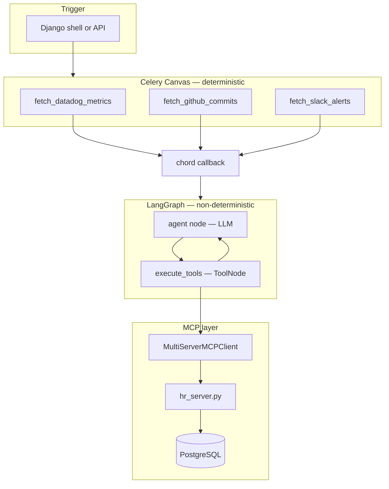

# Agent Architecture — Workstack

Where AI agent code lives in the repo, how it relates to Phase 4 MCP, and why `apps/incidents/` is a separate Django app.

[← README](../README.md) · [Incident Triage Agent →](INCIDENT_TRIAGE_AGENT.md)

---

## Table of Contents

1. [Two phases of AI in Workstack](#1-two-phases-of-ai-in-workstack)
2. [Recommended directory layout](#2-recommended-directory-layout)
3. [Why a separate incidents app](#3-why-a-separate-incidents-app)
4. [What stays untouched](#4-what-stays-untouched)
5. [Layer responsibilities](#5-layer-responsibilities)
6. [MCP vs LangGraph vs Celery — who does what](#6-mcp-vs-langgraph-vs-celery--who-does-what)
7. [Verdict: is this good architecture?](#7-verdict-is-this-good-architecture)

---

## 1. Two phases of AI in Workstack

| Phase | Name | Location | Pattern |
|-------|------|----------|---------|
| **4** | MCP proof-of-loop | `apps/organizations/tasks.py` | Raw Gemini SDK + MCP Client (stdio/SSE) |
| **5** | Production agent | `apps/incidents/tasks.py` | Celery Canvas + LangGraph + LangChain MCP adapter |

Phase 4 proves: **Host → MCP Client → MCP Server → PostgreSQL → Gemini**.

Phase 5 adds: **parallel deterministic fetchers (Celery)** + **stateful agent graph (LangGraph)** + **MCP tools as LangChain tools**.

---

## 2. Recommended directory layout

```
workstack_project/
├── backend/
│   ├── apps/
│   │   ├── organizations/     # Phase 4 — unchanged
│   │   │   ├── tasks.py       # run_ai_org_lookup, send_magic_link_email
│   │   │   └── management/commands/mcp_org_server.py  # stdio dev server
│   │   ├── incidents/         # Phase 5 — NEW agent workflows
│   │   │   └── tasks.py       # Celery chord + LangGraph + MCP
│   │   ├── hris/              # Employee data (queried by MCP tools)
│   │   ├── users/
│   │   └── rbac/
│   ├── mcp_daemons/           # Shared tool servers — NOT owned by one app
│   │   └── hr_server.py       # get_employee_manager (SSE :8080)
│   └── core/
├── docs/
└── docker-compose.yml
```

### Rules

| Component | Lives in | Reason |
|-----------|----------|--------|
| **MCP tool servers** | `mcp_daemons/` | Persistent daemons; shared across workflows |
| **Phase 4 learning code** | `organizations/` | Historical reference; do not refactor |
| **Agent orchestration** | `apps/incidents/` | Domain = incident triage; owns Celery canvas |
| **Future MCP servers** | `mcp_daemons/jira_server.py`, etc. | One file per tool domain |

Do **not** put LangGraph code in `organizations/tasks.py`.  
Do **not** put new MCP servers inside `organizations/management/commands/` for production agents (stdio spawn is fine for Phase 4 demos only).

---

## 3. Why a separate incidents app

| Reason | Detail |
|--------|--------|
| **Single responsibility** | `organizations` = tenants, invites, membership. `incidents` = AI triage workflows. |
| **Celery autodiscover** | Tasks in `apps.incidents.tasks` register cleanly; no mixing with invite email tasks |
| **Interview narrative** | "I separated deterministic I/O from non-deterministic AI reasoning in a dedicated app" |
| **Scale later** | Add `Incident` model, API views, audit logs without touching HRIS code |
| **Testing** | Agent integration tests live beside agent tasks |

Alternative considered: one `apps/agents/` app for all future workflows. That also works at scale. For now, **`incidents`** matches the first use case (Automated Incident Triage) and is clearer in demos.

---

## 4. What stays untouched

| File | Status |
|------|--------|
| `apps/organizations/tasks.py` | Phase 4 — keep as reference |
| `apps/organizations/management/commands/mcp_org_server.py` | stdio dev server |
| `mcp_daemons/hr_server.py` | Shared HR tool server — used by both phases |

Phase 5 **reuses** `hr_server.py` via `MultiServerMCPClient` — it does not duplicate MCP tool logic.

---

## 5. Layer responsibilities



| Layer | Technology | Decides what? |
|-------|------------|---------------|
| **Muscle** | Celery `group` + `chord` | *When* to fetch; *parallelism* |
| **Brain** | LangGraph `StateGraph` | *Flow* — loop, stop, retry paths |
| **Reasoning** | Gemini via LangChain | *Which tool* to call; *final text* |
| **Tools** | MCP Server | *How* to query Postgres |

---

## 6. MCP vs LangGraph vs Celery — who does what

| Question | Answer |
|----------|--------|
| Is MCP an "agent"? | No — MCP is **tool execution plumbing** |
| Is LangGraph the agent? | LangGraph is the **orchestration graph**; LLM + tools together form the agent |
| Can you skip LangGraph? | Yes — Phase 4 is a single ReAct loop without a graph |
| Can you skip MCP? | Yes — LangGraph can call plain Python functions as tools |
| Production pattern | **Combine all three** — Celery for I/O, LangGraph for flow, MCP for decoupled tools |

### Why not use MCP for Celery chord fetchers?

Datadog, GitHub, and Slack fetchers in the example are **deterministic Celery tasks** — no LLM needed. MCP is for tools the **agent chooses mid-reasoning** (e.g. lookup manager after reading commit author from logs).

| Data source | Pattern |
|-------------|---------|
| Known upfront, parallel, no AI choice | Celery tasks |
| Agent decides *if* and *when* to query | MCP tools via LangGraph |

---

## 7. Verdict: is this good architecture?

**Yes** — for a production-grade learning path and interview portfolio:

| Practice | Workstack implementation |
|----------|-------------------------|
| Separate deterministic from AI work | Celery chord → LangGraph callback |
| Shared MCP servers | `mcp_daemons/` not buried in one app |
| Don't break Phase 4 | `organizations/` untouched |
| Domain-driven Django apps | `incidents/` for agent workflows |
| Persistent MCP in prod | SSE daemon; stdio only in agent dev path |

**Not demo-only:** Phase 4 MCP is a valid minimal pattern. Phase 5 is what teams ship when they need **multi-step agents**, **human-in-the-loop nodes**, and **multiple MCP servers**.

---

[LangGraph deep dive →](LANGGRAPH_DEEP_DIVE.md) · [LangChain + MCP →](LANGCHAIN_MCP_INTEGRATION.md) · [Run & test →](INCIDENT_TRIAGE_AGENT.md)
