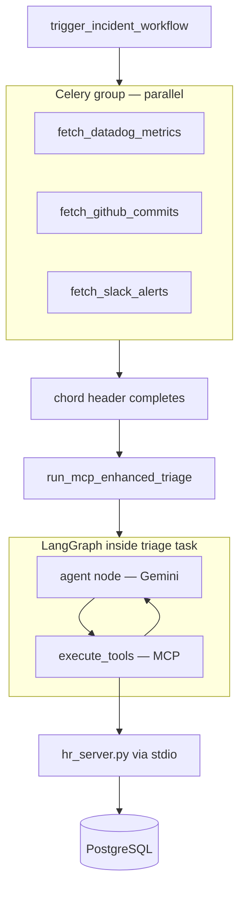

# Automated Incident Triage Agent — Run & Test Guide

End-to-end guide for the Phase 5 agent: Celery chord → LangGraph → MCP HR lookup.

**Code:** `backend/apps/incidents/tasks.py`

[← Architecture](AGENT_ARCHITECTURE.md) · [LangGraph](LANGGRAPH_DEEP_DIVE.md) · [LangChain + MCP](LANGCHAIN_MCP_INTEGRATION.md)

---

## Table of Contents

1. [What this agent does](#1-what-this-agent-does)
2. [Prerequisites](#2-prerequisites)
3. [Architecture walkthrough](#3-architecture-walkthrough)
4. [Line-by-line code map](#4-line-by-line-code-map)
5. [Version A vs Version B](#5-version-a-vs-version-b)
6. [How to test](#6-how-to-test)
7. [Expected output](#7-expected-output)
8. [Troubleshooting](#8-troubleshooting)
9. [Interview pitch](#9-interview-pitch)

---

## 1. What this agent does

**Scenario:** Production server `srv-production-01` is failing.

| Step | System | Action |
|------|--------|--------|
| 1 | Celery `group` | Fetch Datadog, GitHub, Slack data **in parallel** |
| 2 | Celery `chord` | Pass aggregated logs to triage task |
| 3 | LangGraph agent | Read logs; identify commit author |
| 4 | MCP tool | Look up author's manager in Workstack HR DB |
| 5 | LangGraph agent | Draft incident report to manager |

---

## 2. Prerequisites

### Services running

```bash
make up
# Requires: db, redis, rabbitmq, celery, mcp_hr_daemon (optional for stdio path)
```

### Environment

```env
GEMINI_API_KEY=your_key
DATABASE_URL=...
CELERY_BROKER_URL=...
```

### Python packages

Install LangChain stack (see [LANGCHAIN_MCP_INTEGRATION.md](LANGCHAIN_MCP_INTEGRATION.md)):

```bash
docker compose exec web pip install langchain-core langchain-google-genai langgraph langchain-mcp-adapters
```

Or add to `requirements/base.txt` and rebuild.

### HR data in database

The agent calls `get_employee_manager` for the commit author email. Ensure a user exists:

- Username/email: `shuaib@workstack.dev` (or match `fetch_github_commits` mock author)
- Employee record with a manager in org chart

---

## 3. Architecture walkthrough



---

## 4. Line-by-line code map

### Section 1 — Muscle (lines 15–28)

```python
@shared_task
def fetch_datadog_metrics(server_id):
    time.sleep(1)
    return {"source": "Datadog", "cpu_usage": "99%", ...}
```

Three independent Celery tasks. **No AI.** Simulate external API latency with `sleep`.

### Section 2 — Brain entry (lines 35–38)

```python
@shared_task
def run_mcp_enhanced_triage(aggregated_logs, server_id):
    return asyncio.run(_async_agent_execution(aggregated_logs, server_id))
```

Celery chord passes `aggregated_logs` as **first argument** automatically — list of three dicts from the group.

### Section 2 — MCP + graph (lines 40–89)

| Lines | Purpose |
|-------|---------|
| 41 | LangChain Gemini chat model |
| 42 | Path to shared `hr_server.py` |
| 44–50 | Connect MCP server via stdio subprocess |
| 52–54 | Convert MCP tools → LangChain; bind to LLM; create ToolNode |
| 56–62 | Agent node + router (`should_continue`) |
| 64–72 | Build and compile StateGraph |
| 74–85 | Prompt with pre-fetched logs + instructions |
| 85–89 | `ainvoke` graph; print final message |

### Section 3 — Trigger (lines 93–104)

```python
parallel_fetchers = group(...)
workflow = chord(parallel_fetchers)(run_mcp_enhanced_triage.s(server_id))
```

`.s(server_id)` binds `server_id` as second arg to callback after chord results.

---

## 5. Version A vs Version B

| | Version A — logs only graph | Version B — MCP enhanced (current) |
|---|----------------------------|-------------------------------------|
| Chord fetchers | Same | Same |
| LangGraph | Fixed nodes: analyze → decide | ReAct loop: agent ↔ tools |
| MCP | Not used | `get_employee_manager` |
| Manager lookup | Hardcoded or guessed | Real Postgres via MCP |
| File | Conceptual / earlier draft | `incidents/tasks.py` |

Workstack implements **Version B**. Phase 4 in `organizations/` remains the minimal MCP loop reference.

---

## 6. How to test

### Step 1 — Confirm Celery worker sees tasks

```bash
docker compose logs celery -f
```

Look for registered task names including `apps.incidents.tasks`.

### Step 2 — Launch workflow from Django shell

```bash
docker compose exec web python manage.py shell
```

```python
from apps.incidents.tasks import trigger_incident_workflow
trigger_incident_workflow()
```

### Step 3 — Watch Celery logs

You should see:

1. Three fetch tasks start and complete (~1s each, parallel)
2. `run_mcp_enhanced_triage` starts
3. MCP subprocess spawns (stdio) or connects to daemon
4. LangGraph agent/tool cycles in logs
5. `--- FINAL AI AGENT OUTPUT ---` printed

### Step 4 — Optional: test MCP alone first

Before spending Gemini quota:

```bash
docker compose exec web python manage.py test apps.organizations.tests.test_mcp_sse -v 2
```

Proves HR server works independently of LangGraph.

### Step 5 — Optional: test chord without AI

Temporarily replace callback with a print task to verify Canvas wiring before debugging LangGraph.

---

## 7. Expected output

```
Orchestration Canvas launched! Task ID: <uuid>
```

In Celery worker logs (abbreviated):

```
[INFO] Task apps.incidents.tasks.fetch_datadog_metrics[...] succeeded
[INFO] Task apps.incidents.tasks.fetch_github_commits[...] succeeded
[INFO] Task apps.incidents.tasks.fetch_slack_alerts[...] succeeded
[INFO] Task apps.incidents.tasks.run_mcp_enhanced_triage[...] received

--- FINAL AI AGENT OUTPUT ---
Subject: Critical Incident — srv-production-01
...
Manager: ... (shuaib@acmecorp.com)
...
```

Exact wording varies — Gemini is non-deterministic. Success = tool was called + manager name from DB appears.

---

## 8. Troubleshooting

| Issue | Fix |
|-------|-----|
| `ModuleNotFoundError: langgraph` | Install LangChain stack in container |
| `GEMINI_API_KEY` missing | Set in `.env`; restart celery |
| Chord never runs callback | All group tasks must succeed; check fetcher errors |
| MCP async context error | Use SSE daemon or stdio script with sync tools (see MCP_SSE_HTTP.md) |
| Tool not called | Strengthen prompt; ensure author email exists in DB |
| Employee not found | Align `fetch_github_commits` author with real `User.username` |

---

## 9. Interview pitch

> I separate **deterministic I/O from non-deterministic AI reasoning**. A Celery **chord** fans out parallel API fetches across workers. When all context is gathered, the callback boots a **LangGraph** agent with **MCP tools** attached via LangChain adapters. The graph controls flow; Gemini chooses tools; MCP servers query our Django ORM in isolated processes. Phase 4 proved the MCP wire protocol; Phase 5 is the production agent pattern I'd use for incident triage or voice-AI backends at scale.

---

## Quick reference

| Item | Location |
|------|----------|
| Agent tasks | `apps/incidents/tasks.py` |
| Phase 4 MCP (unchanged) | `apps/organizations/tasks.py` |
| HR MCP server | `mcp_daemons/hr_server.py` |
| Trigger | `trigger_incident_workflow()` |
| MCP SSE test | `apps/organizations/tests/test_mcp_sse.py` |

---

[← README](../README.md) · [Agent Architecture](AGENT_ARCHITECTURE.md)
