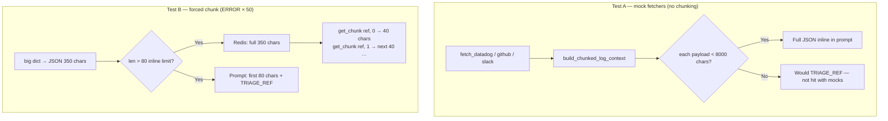
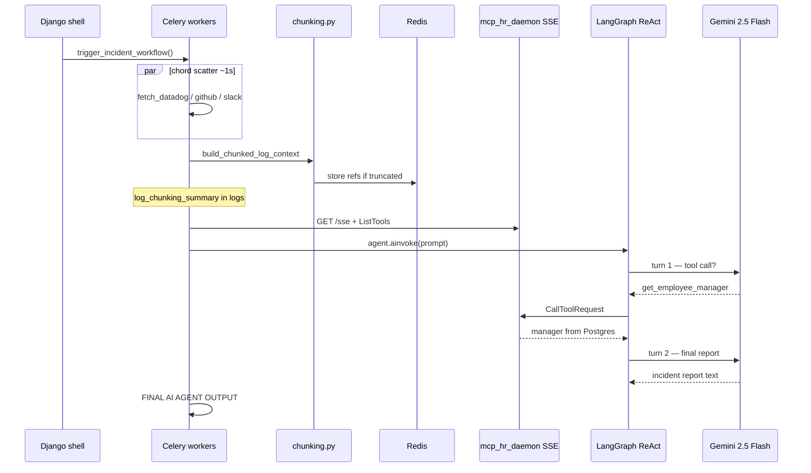

# Incident Triage — Local Test Walkthrough

Copy-paste shell session for **Phase 2–5** (chunking, full triage, checkpoints, live stream) with expected output and verified test results. Run inside Docker.

**Full runbook:** [INCIDENT_TRIAGE_AGENT.md](INCIDENT_TRIAGE_AGENT.md) §6 · **Q&A:** [INCIDENT_TRIAGE_QA.md](INCIDENT_TRIAGE_QA.md)

---

## Setup

```bash
cd ~/django_projects/workstack_project

# Full stack for Phase 3
docker compose up -d db redis rabbitmq web celery mcp_hr_daemon

# After .env changes (e.g. TRIAGE_MAX_INLINE_CHARS)
docker compose up -d --force-recreate celery
```

**Terminal layout for Phase 3:**

| Terminal | Command |
|----------|---------|
| **A** | `docker compose logs celery -f` |
| **B** | `docker compose exec web python manage.py shell` |
| **C** | `curl` for Phase 4 / 5 checkpoints (optional) |

---

## Phase 2 — Chunking (two tests)

### Flow overview



| Test | Function | Chunking? | Proves |
|------|----------|-----------|--------|
| **A** | `build_chunked_log_context(logs, run_id)` | No — mocks are small | Normal path: full telemetry inline, no `[TRIAGE_REF]` |
| **B** | `prepare_payload_for_prompt(...)` inside `override_settings` | Yes — artificial 80-char cap | Overflow → Redis + marker + slice reads |

---

### Test A — mock logs (no chunking)

```python
from apps.incidents.tasks import (
    fetch_datadog_metrics,
    fetch_github_commits,
    fetch_slack_alerts,
)
from apps.incidents.chunking import build_chunked_log_context

run_id = "shell-chunk-test"
logs = [
    fetch_datadog_metrics("srv-production-01"),
    fetch_github_commits("srv-production-01"),
    fetch_slack_alerts("srv-production-01"),
]

print(build_chunked_log_context(logs, run_id)[0][:400])
```

**Expected output (abbreviated):**

```text
### Datadog
{
  "source": "Datadog",
  "cpu_usage": "99%",
  "status": "critical"
}

### GitHub
{
  "source": "GitHub",
  "recent_commit": "Update nginx config",
  "author": "katrina@newhire.com"
}

### Slack
...
```

**Pass criteria:** Full JSON for each source. **No** `[TRIAGE_REF` anywhere. Same behavior as real triage when logs fit in `TRIAGE_MAX_INLINE_CHARS` (default 8000).

**With `TRIAGE_MAX_INLINE_CHARS=50` in `.env`:** mock fetchers **will** truncate (each JSON &gt; 50 chars). Celery logs show:

```text
--- CHUNKING SUMMARY (testing — comment out in tasks.py when done) ---
TRIAGE_MAX_INLINE_CHARS=50 TRIAGE_CHUNK_SIZE=4000
  [Datadog] TRUNCATED → Redis | total=... inline=... chunks=1
    reference_id=<run_id>:Datadog:...
    marker: ...[TRIAGE_REF source=Datadog id=...
--- END CHUNKING SUMMARY ---
```

Restart Celery after changing `.env`: `docker compose up -d --force-recreate celery`

---

### Test B — forced chunking

```python
from apps.incidents.chunking import prepare_payload_for_prompt, get_chunk
from django.test.utils import override_settings

run_id = "shell-chunk-test"

with override_settings(TRIAGE_MAX_INLINE_CHARS=80, TRIAGE_CHUNK_SIZE=40):
    big = {"source": "Datadog", "lines": ["ERROR " * 50]}
    r = prepare_payload_for_prompt("Datadog", big, run_id)

    print("truncated:", r.truncated)
    print("reference_id:", r.reference_id)
    print("total_chars:", r.total_chars)
    print("chunk_count:", r.chunk_count)
    print("inline tail:", r.inline[-100:])
    print("chunk 0:", repr(get_chunk(r.reference_id, 0)))
    print("chunk 1:", repr(get_chunk(r.reference_id, 1)))
    print("chunk 2:", repr(get_chunk(r.reference_id, 2)))
```

**Expected output:**

```text
truncated: True
reference_id: shell-chunk-test:Datadog:40c13715
total_chars: 350
chunk_count: 9
inline tail: ...TRIAGE_REF source=Datadog id=shell-chunk-test:Datadog:40c13715 total_chars=350 chunks=9 inline_limit=80]
chunk 0: '{\n  "source": "Datadog",\n  "lines": [\n    "ER'
chunk 1: 'ROR ERROR ERROR ERROR ERROR ERROR ERROR ERROR ER'
chunk 2: 'ROR ERROR ERROR ERROR ERROR ERROR ERROR ERROR ER'
```

| Field | Value | Meaning |
|-------|-------|---------|
| `total_chars` | 350 | Full JSON size |
| `chunk_count` | 9 | `ceil(350 / 40)` |
| `inline` | First 80 chars + marker | What the LLM sees in turn 1 |
| `chunk 0` | 40 chars | Slice `[0:40]` of full JSON |

**Important:** Call `get_chunk()` **inside** the same `with override_settings(...)` block.  
`TRIAGE_CHUNK_SIZE` defaults to **4000** outside that block — then chunk 0 returns the **entire** 350-char string and chunk 1 shows out of range:

```text
# WRONG — ran get_chunk in a new shell cell without override_settings
chunk 0: '{ ... entire 350 char JSON ... }'
chunk 1: '[chunk 1 out of range for reference shell-chunk-test:Datadog:40c13715]'
```

That is **settings**, not a bug.

---

### Read full blob from Redis (pretty)

Use Django cache — **not** raw `redis-cli GET` (pickle binary).

```python
from django.core.cache import cache
from apps.incidents.chunking import get_chunk
from django.test.utils import override_settings

ref = "shell-chunk-test:Datadog:40c13715"  # paste your reference_id

full = cache.get(f"triage:ref:{ref}")
print("Full length:", len(full))  # 350

with override_settings(TRIAGE_CHUNK_SIZE=40):
    for i in range(3):
        print(f"chunk {i}:", repr(get_chunk(ref, i)))
```

**Expected:**

```text
Full length: 350
chunk 0: '{\n  "source": "Datadog",\n  "lines": [\n    "ER'
chunk 1: 'ROR ERROR ERROR ERROR ERROR ERROR ERROR ERROR ER'
chunk 2: 'ROR ERROR ERROR ERROR ERROR ERROR ERROR ERROR ER'
```

---

### Redis CLI — key exists only

```bash
docker compose exec redis redis-cli -n 1 KEYS "*triage:ref*"
```

**Expected:**

```text
1) ":1:triage:ref:shell-chunk-test:Datadog:40c13715"
```

| Symbol | Meaning |
|--------|---------|
| `:1:` | Django cache version prefix — **success**, not an error |
| Pickle blob on `GET` | Normal — use `cache.get()` in Python for readable JSON |

```bash
# Shows binary pickle — content is mostly "ERROR ERROR ..." from test data
docker compose exec redis redis-cli -n 1 GET ":1:triage:ref:shell-chunk-test:Datadog:40c13715"
```

---

## Phase 2 checklist

| Step | Pass? |
|------|-------|
| Test A: full inline JSON, no `TRIAGE_REF` | |
| Test B: `truncated=True`, `reference_id` set | |
| Test B: `chunk_count=9` for 350 chars / size 40 | |
| `KEYS *triage:ref*` returns `:1:triage:ref:...` | |
| `cache.get` → `len(full)==350` | |
| `get_chunk` slices inside `override_settings` | |

---

## Phase 3 — Full flow (Celery → chunk → LangGraph → MCP SSE → Gemini)

### Flow overview



### Trigger

**Terminal B:**

```bash
docker compose exec web python manage.py shell
```

```python
from apps.incidents.tasks import trigger_incident_workflow

result = trigger_incident_workflow()
run_id = result["run_id"]
print(run_id)
# Live stream URL printed: /api/v1/incidents/runs/<run_id>/stream/
```

**Terminal A** — watch Celery (~20–30s).

---

### Mode A — default (`TRIAGE_MAX_INLINE_CHARS=8000`)

Mock fetchers are small → **no truncation**, no Redis refs for this run.

**Chunking summary in Celery (all inline):**

```text
--- CHUNKING SUMMARY (testing — comment out in tasks.py when done) ---
TRIAGE_MAX_INLINE_CHARS=8000 TRIAGE_CHUNK_SIZE=4000
  [Datadog] inline (full) | total=71 inline=71 chunks=1
  [GitHub] inline (full) | total=101 inline=101 chunks=1
  [Slack] inline (full) | total=93 inline=93 chunks=1
--- END CHUNKING SUMMARY ---
```

**Typical Celery tail:**

```text
[INFO] Task ... fetch_* succeeded (×3)
[INFO] Task ... run_mcp_enhanced_triage received
[INFO] HTTP Request: GET http://workstack_mcp_hr:8080/sse "HTTP/1.1 200 OK"
[INFO] HTTP Request: POST .../gemini-2.5-flash:generateContent "HTTP/1.1 200 OK"
... CallToolRequest in mcp_hr_daemon logs ...
--- FINAL AI AGENT OUTPUT ---
Subject: EMERGENCY INCIDENT REPORT: Critical Issue on srv-production-01
To: shuaib@acmecorp.com
...
[INFO] Task ... run_mcp_enhanced_triage succeeded
```

| Check | Pass criteria |
|-------|---------------|
| Chord | 3 fetchers succeed, then triage callback |
| Chunking | All sources `inline (full)` — no `TRIAGE_REF` |
| MCP | SSE 200, `CallToolRequest` in `mcp_hr_daemon` logs |
| LLM | Gemini 200 (503 retries OK), final report text |
| HR tool | Manager email from DB (e.g. `shuaib@acmecorp.com`) |

---

### Mode B — forced truncate (`TRIAGE_MAX_INLINE_CHARS=50`)

Set in `.env`, then **recreate Celery**:

```env
TRIAGE_MAX_INLINE_CHARS=50
```

```bash
docker compose up -d --force-recreate celery
```

Re-run `trigger_incident_workflow()`. **Verified test run** (`run_id=2db76262-6b26-49b9-83ef-64384ca1cab0`):

**Chunking summary (Celery WARNING lines):**

```text
--- CHUNKING SUMMARY (testing — comment out in tasks.py when done) ---
TRIAGE_MAX_INLINE_CHARS=50 TRIAGE_CHUNK_SIZE=4000
  [Datadog] TRUNCATED → Redis | total=71 inline=176 chunks=1
    reference_id=2db76262-6b26-49b9-83ef-64384ca1cab0:Datadog:cd9918fa
    marker: ...[TRIAGE_REF source=Datadog id=2db76262-6b26-49b9-83ef-64384ca1cab0:Datadog:cd9918fa total_chars=71 chunks=1 inline_limit
  [GitHub] TRUNCATED → Redis | total=101 inline=175 chunks=1
    reference_id=2db76262-6b26-49b9-83ef-64384ca1cab0:GitHub:f396ea31
    marker: ...[TRIAGE_REF source=GitHub id=2db76262-6b26-49b9-83ef-64384ca1cab0:GitHub:f396ea31 total_chars=101 chunks=1 inline_limit=
  [Slack] TRUNCATED → Redis | total=93 inline=172 chunks=1
    reference_id=2db76262-6b26-49b9-83ef-64384ca1cab0:Slack:05233f54
    marker: ...[TRIAGE_REF source=Slack id=2db76262-6b26-49b9-83ef-64384ca1cab0:Slack:05233f54 total_chars=93 chunks=1 inline_limit=50]
--- END CHUNKING SUMMARY ---
```

| Field | Example | Meaning |
|-------|---------|---------|
| `total=71` | Datadog JSON size | Full payload stored in Redis |
| `inline=176` | Datadog | First 50 chars + `\n\n` + `[TRIAGE_REF ...]` marker |
| `chunks=1` | All sources | One slice — payload &lt; `TRIAGE_CHUNK_SIZE` (4000) |
| `reference_id` | `{run_id}:Datadog:cd9918fa` | Key for `cache.get("triage:ref:...")` |

**Why `inline` &gt; 50?** Inline = truncated JSON **plus** the `[TRIAGE_REF ...]` footer sent to Gemini.

**Redis keys after run:**

```bash
docker compose exec redis redis-cli -n 1 KEYS "*triage:ref*"
```

```text
1) ":1:triage:ref:shell-chunk-test:Datadog:40c13715"          ← Phase 2 shell test (old)
2) ":1:triage:ref:2db76262-6b26-49b9-83ef-64384ca1cab0:GitHub:f396ea31"
3) ":1:triage:ref:2db76262-6b26-49b9-83ef-64384ca1cab0:Slack:05233f54"
4) ":1:triage:ref:2db76262-6b26-49b9-83ef-64384ca1cab0:Datadog:cd9918fa"
```

**Read blob (pickle in CLI — JSON visible inside):**

```bash
docker compose exec redis redis-cli -n 1 GET ":1:triage:ref:2db76262-6b26-49b9-83ef-64384ca1cab0:GitHub:f396ea31"
# Contains: "recent_commit": "Update nginx config", "author": "katrina@newhire.com"
```

Pretty read in Django shell:

```python
from django.core.cache import cache
ref = "2db76262-6b26-49b9-83ef-64384ca1cab0:GitHub:f396ea31"
print(cache.get(f"triage:ref:{ref}"))
```

After Mode B testing, reset `.env`: `TRIAGE_MAX_INLINE_CHARS=8000` and recreate Celery.

---

### MCP HR daemon logs (Phase 3)

```text
INFO: POST /messages/?session_id=... HTTP/1.1 202 Accepted
Processing request of type CallToolRequest
Processing request of type ListToolsRequest
```

Confirms LangGraph called `get_employee_manager` over SSE.

---

## Phase 3 checklist

| Step | Mode A (8000) | Mode B (50) |
|------|---------------|-------------|
| 3 fetchers succeed | ✓ | ✓ |
| `CHUNKING SUMMARY` in Celery | all `inline (full)` | all `TRUNCATED → Redis` |
| Redis `triage:ref:<run_id>:*` | none new | 3 keys |
| SSE MCP 200 | ✓ | ✓ |
| Gemini + final report | ✓ | ✓ |
| Task succeeded | ✓ | ✓ |

---

## Phase 4 — Checkpoints (JSON API)

Poll all checkpoints after a run completes. Uses `events.py` → Redis list `triage:run:<run_id>:events`.

### Command

```bash
curl -s http://localhost:8000/api/v1/incidents/runs/<run_id>/events/ | python3 -m json.tool
```

Use the `run_id` from `trigger_incident_workflow()`:

```python
result = trigger_incident_workflow()
# Orchestration Canvas launched! ... Run ID: a7f96583-5577-4706-a2a6-f2d53422e89f
```

### Verified output (`run_id=a7f96583-5577-4706-a2a6-f2d53422e89f`, `TRIAGE_MAX_INLINE_CHARS=50`)

```json
{
    "run_id": "a7f96583-5577-4706-a2a6-f2d53422e89f",
    "events": [
        {
            "stage": "triage.start",
            "message": "Starting triage for srv-production-01",
            "server_id": "srv-production-01",
            "mcp_transport": "sse"
        },
        { "stage": "fetch.complete", "message": "Context gathered from parallel fetchers" },
        {
            "stage": "chunk.complete",
            "message": "Telemetry payloads prepared for LLM context limits",
            "sources": [
                {
                    "source": "Datadog",
                    "truncated": true,
                    "total_chars": 71,
                    "chunk_count": 1,
                    "inline_chars": 176,
                    "reference_id": "a7f96583-5577-4706-a2a6-f2d53422e89f:Datadog:81324193"
                },
                {
                    "source": "GitHub",
                    "truncated": true,
                    "total_chars": 101,
                    "chunk_count": 1,
                    "inline_chars": 175,
                    "reference_id": "a7f96583-5577-4706-a2a6-f2d53422e89f:GitHub:2eea65ef"
                },
                {
                    "source": "Slack",
                    "truncated": true,
                    "total_chars": 93,
                    "chunk_count": 1,
                    "inline_chars": 172,
                    "reference_id": "a7f96583-5577-4706-a2a6-f2d53422e89f:Slack:5e72f28b"
                }
            ]
        },
        { "stage": "mcp.connect", "message": "Connecting to HR MCP server" },
        { "stage": "mcp.tools", "message": "MCP tools ready (1 available)", "tool_count": 1 },
        { "stage": "agent.invoke", "message": "LangGraph ReAct agent running" },
        { "stage": "agent.complete", "message": "Agent finished reasoning loop" },
        {
            "stage": "triage.complete",
            "message": "Incident report ready",
            "report_preview": "...GitHub log entry is truncated..."
        }
    ]
}
```

### Stage reference

| `stage` | Proves |
|---------|--------|
| `triage.start` | Callback started; shows `mcp_transport: sse` |
| `fetch.complete` | Chord logs received |
| `chunk.complete` | Chunking ran; **`sources`** mirrors Celery `CHUNKING SUMMARY` |
| `mcp.connect` / `mcp.tools` | SSE MCP client connected |
| `agent.invoke` / `agent.complete` | LangGraph + Gemini loop |
| `triage.complete` | Final report; `report_preview` first 500 chars |

### Raw Redis (same data, reverse order)

```bash
docker compose exec redis redis-cli -n 1 LRANGE "triage:run:a7f96583-5577-4706-a2a6-f2d53422e89f:events" 0 -1
```

| API `/events/` | Redis `LRANGE` |
|----------------|----------------|
| Oldest event **first** | Newest event **first** (LPUSH) |
| JSON array, pretty-printed | One JSON string per line |

Entry `6` in LRANGE = `chunk.complete` with full `sources` array — matches the API.

### Phase 4 checklist

| Check | Pass? |
|-------|-------|
| 8 events returned | ✓ |
| `chunk.complete.sources` has 3 entries with `truncated: true` | ✓ |
| `reference_id` matches Celery chunk summary | ✓ |
| `triage.complete.report_preview` present | ✓ |

### Note — aggressive truncate (`limit=50`) vs agent quality

With only 50 chars inline, Gemini may report *"GitHub log is truncated… author not available"* even though the **full JSON is in Redis** (including `katrina@newhire.com`). That is expected until **`read_triage_chunk` MCP tool** (Phase 2 chunking roadmap) lets the agent pull the rest. For normal runs use `TRIAGE_MAX_INLINE_CHARS=8000`.

---

## Phase 5 — Live checkpoint stream (SSE)

Real-time checkpoints while triage runs. Same events as Phase 4, delivered as `data: {...}` lines.

### Option A — stream after trigger (replay + tail)

```bash
curl -N http://localhost:8000/api/v1/incidents/runs/<run_id>/stream/
```

Works if started within ~30s of trigger — replays history, then live events until `triage.complete`.

### Option B — live demo (recommended)

**1. Shell — create `run_id` first:**

```python
import uuid
run_id = str(uuid.uuid4())
print(run_id)
# 4235fbe3-6786-4707-a6c0-334b429b911d
```

**2. Terminal C — start stream before chord finishes:**

```bash
curl -N http://localhost:8000/api/v1/incidents/runs/4235fbe3-6786-4707-a6c0-334b429b911d/stream/
```

**3. Shell — trigger with same `run_id`:**

```python
from celery import group, chord
from apps.incidents.tasks import (
    fetch_datadog_metrics,
    fetch_github_commits,
    fetch_slack_alerts,
    run_mcp_enhanced_triage,
)

server_id = "srv-production-01"
chord(group(
    fetch_datadog_metrics.s(server_id),
    fetch_github_commits.s(server_id),
    fetch_slack_alerts.s(server_id),
))(run_mcp_enhanced_triage.s(server_id, run_id))
```

### Verified stream output (`run_id=4235fbe3-6786-4707-a6c0-334b429b911d`)

```text
data: {"ts": ..., "stage": "triage.start", "message": "Starting triage for srv-production-01", "mcp_transport": "sse"}

data: {"stage": "fetch.complete", ...}

data: {"stage": "chunk.complete", "sources": [{"source": "Datadog", "truncated": true, ...}, ...]}

data: {"stage": "mcp.connect", ...}
data: {"stage": "mcp.tools", "tool_count": 1, ...}
data: {"stage": "agent.invoke", ...}

data: {"stage": "agent.complete", ...}

data: {"stage": "triage.complete", "report_preview": "...GitHub... truncated..."}
```

Stream **closes** after `triage.complete` (by design in `TriageRunStreamView`).

### `curl: (56) chunk hex-length char not a hex digit: 0x48`

You may see this **after** all events printed:

```text
curl: (56) chunk hex-length char not a hex digit: 0x48
```

| Item | Explanation |
|------|-------------|
| **Cause** | Server closed the SSE connection when stream ended; some `curl` versions warn on the final chunk |
| **Impact** | **None** — all 8 `data:` lines were delivered; flow completed |
| **Pass?** | Yes, if you saw `triage.complete` |

Alternative: use browser DevTools → Network → EventStream, or `events/` JSON API for polling.

### Verify Phase 5 via Redis (same run)

```bash
docker compose exec redis redis-cli -n 1 LRANGE "triage:run:4235fbe3-6786-4707-a6c0-334b429b911d:events" 0 -1
```

8 entries — matches stream event count.

### Celery tail (same run, ~19s)

```text
--- CHUNKING SUMMARY ---
  [Datadog/GitHub/Slack] TRUNCATED → Redis | ...
GET http://workstack_mcp_hr:8080/sse "HTTP/1.1 200 OK"
Gemini 503 → retry → 200 OK
--- FINAL AI AGENT OUTPUT ---
I cannot identify the employee... GitHub log is truncated...
Task ... run_mcp_enhanced_triage succeeded in 18.61s
```

### Phase 5 checklist

| Check | Pass? |
|-------|-------|
| Stream shows events in order (start → complete) | ✓ |
| `chunk.complete` includes `sources` array live | ✓ |
| Stream ends on `triage.complete` | ✓ |
| Redis LRANGE has 8 events for same `run_id` | ✓ |
| `curl (56)` after complete | Harmless |

---

## All phases checklist

| Phase | What | Status |
|-------|------|--------|
| **1** | Preflight (`test_mcp_sse`, `test_chunking`) | |
| **2** | Shell chunking A + B | |
| **3** | Celery → LangGraph → MCP → Gemini | |
| **4** | `/events/` JSON + `chunk.complete.sources` | |
| **5** | `/stream/` live SSE | |

---

## Next

→ Reset `TRIAGE_MAX_INLINE_CHARS=8000` after truncate testing  
→ Comment out `log_chunking_summary(chunk_payloads)` in `tasks.py`  
→ Build **`read_triage_chunk` MCP tool** so agent can read Redis refs when truncated  
→ [INCIDENT_TRIAGE_AGENT.md §6](INCIDENT_TRIAGE_AGENT.md#6-how-to-test) — full runbook

---

[← Run guide](INCIDENT_TRIAGE_AGENT.md) · [← README](../README.md)
