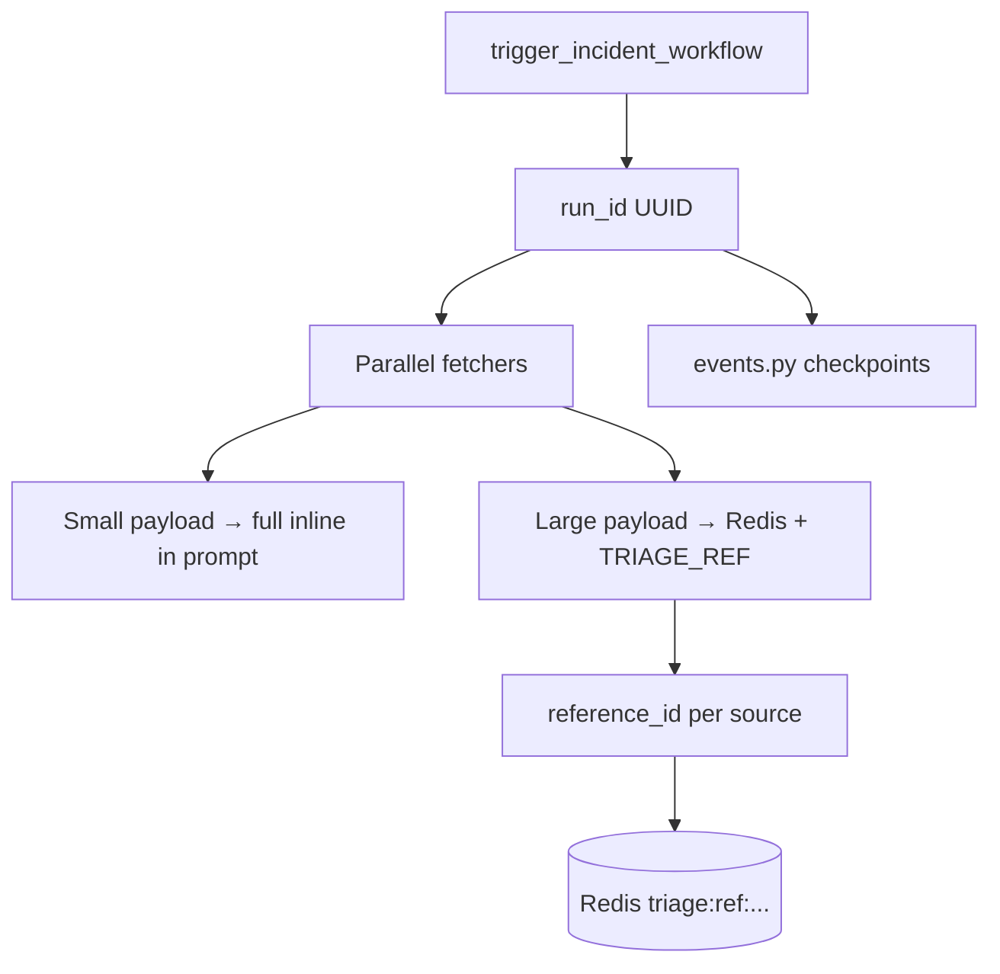
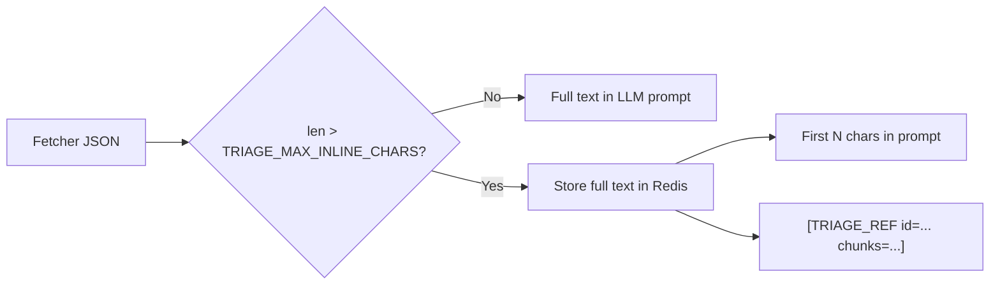

# Incident Triage — Q&A & Design Discussion

Research notes and answers from building the Workstack triage agent: chunking, Redis, live events, MCP transport, and LangGraph choices.

**Related:** [Triage product roadmap](TRIAGE_PRODUCT.md) · [Run guide](INCIDENT_TRIAGE_AGENT.md) · [MCP gaps](MCP_PROTOCOL_GAPS_AND_CONTRIBUTIONS.md)

---

## Table of Contents

1. [Django cache vs Redis for chunks](#1-django-cache-vs-redis-for-chunks)
2. [Django cache vs get_redis_connection (events)](#2-django-cache-vs-get_redis_connection-events)
3. [run_id vs reference_id](#3-run_id-vs-reference_id)
4. [Chunking today vs next (TRIAGE_REF + MCP tool)](#4-chunking-today-vs-next-triage_ref--mcp-tool)
5. [Market libraries — build from scratch?](#5-market-libraries--build-from-scratch)
6. [SSE transport — is client pooling a flaw?](#6-sse-transport--is-client-pooling-a-flaw)
7. [Commented StateGraph block in tasks.py](#7-commented-stategraph-block-in-taskspy)
8. [create_react_agent vs manual add_messages graph](#8-create_react_agent-vs-manual-add_messages-graph)
9. [Quick reference](#9-quick-reference)

---

## 1. Django cache vs Redis for chunks

### Question

`chunking.py` uses `from django.core.cache import cache`. Are we using Django cache? Can we use the Redis server directly instead?

### Answer

**Yes — chunking already stores data in Redis.**

In `core/settings/base.py`:

```python
CACHES = {
    'default': {
        'BACKEND': 'django_redis.cache.RedisCache',
        'LOCATION': 'redis://redis:6379/1',  # Redis database 1
    }
}
```

When `chunking.py` calls:

```python
cache.set(f"triage:ref:{reference_id}", full_text, timeout=3600)
```

that writes to the **Redis container** through Django’s cache abstraction — not to a separate in-memory cache.

**Redis CLI note:** `django-redis` stores keys with a version prefix, e.g. `:1:triage:ref:run-id:Datadog:abc123`. Use `KEYS "*triage:ref*"` to find them; `GET` must include the full key including `:1:`.

| Layer | What it is |
|-------|------------|
| `django.core.cache` | High-level **key → value** API with TTL |
| `django_redis` backend | Implements that API on top of Redis |
| Redis DB `/1` | Actual storage for chunk references |

**Could we use `get_redis_connection` in chunking instead?** Yes. Same Redis server, more direct control (no Django key prefix or serialization). Functionally equivalent for string blobs. We chose `cache` for chunk storage because it is simple key-value; events need lists and pub/sub (see §2).

### Redis layout in Workstack

| Redis DB | Purpose |
|----------|---------|
| `/1` | Django cache (chunk refs) + triage event keys via `get_redis_connection("default")` |
| `/2` | Celery result backend |

---

## 2. Django cache vs get_redis_connection (events)

### Question

`events.py` uses `get_redis_connection` from `django_redis`. What is the difference from `django.core.cache`?

### Answer

**Same Redis server (DB `/1`), different APIs for different data shapes.**

| Need | API | Used in |
|------|-----|---------|
| Store one blob by key + TTL | `cache.set` / `cache.get` | `chunking.py` |
| Ordered list + live pub/sub | `get_redis_connection` → `LPUSH`, `LRANGE`, `PUBLISH` | `events.py`, `views.py` |

```python
# chunking — key-value
cache.set(f"triage:ref:{reference_id}", full_text, timeout=3600)

# events — list history + pub/sub for live SSE
conn.lpush(key, payload)
conn.publish(channel, payload)
```

The cache API does not expose Redis lists or pub/sub cleanly, so live triage checkpoints use the raw client.

---

## 3. run_id vs reference_id

### Question

What are `run_id` and `reference_id` in `store_reference(text, run_id, source)`?

### Answer

Think of one triage execution as a folder:

| ID | Scope | Example | Purpose |
|----|--------|---------|---------|
| **`run_id`** | Entire triage run | `a1b2c3d4-e5f6-...` | Live SSE stream, checkpoints, one `trigger_incident_workflow()` |
| **`reference_id`** | One **oversized payload** in that run | `a1b2c3d4-...:Datadog:fa3b9c12` | Redis key for full text when prompt is truncated |

One `run_id` can have **multiple** `reference_id` values (e.g. large Datadog blob + large Slack blob).



Code in `chunking.py`:

```python
reference_id = f"{run_id}:{source}:{uuid.uuid4().hex[:8]}"
cache.set(f"triage:ref:{reference_id}", full_text, timeout=...)
```

---

## 4. Chunking today vs next (TRIAGE_REF + MCP tool)

### Question

Is `TRIAGE_REF` + Redis the current design? Is `read_triage_chunk(ref_id, index)` next? What is the full plan?

### Answer

**Correct.**

### Chunk 1 — shipped today



| Component | Role |
|-----------|------|
| `ChunkedPayload` | Small dataclass: source, inline text, ref id, counts |
| `prepare_payload_for_prompt()` | Serialize dict → JSON → cap or reference |
| `build_chunked_log_context()` | Build prompt section from chord results |
| `get_chunk()` | **Python helper only** — agent cannot call it yet |

The prompt tells the model about `[TRIAGE_REF ...]`, but without an MCP tool the agent only sees the **inline prefix** (~8000 chars default).

### Chunk 2 — planned next

Add an MCP tool (on `hr_server.py` or a dedicated `triage_server.py`):

```text
read_triage_chunk(reference_id: str, chunk_index: int) -> str
```

ReAct loop then:

1. Reads inline + `[TRIAGE_REF id=... chunks=12]`
2. **Calls tool** to pull chunk 0, 1, 2… only when needed
3. Diagnoses without putting 5MB in turn 1

### Chunk 3 — later

Apply the same pattern to **MCP tool responses** (not only Celery fetchers), so heavy `get_logs` output is chunked at the protocol boundary.

---

## 5. Market libraries — build from scratch?

### Question

Are there existing libraries for log chunking before sending to an LLM?

### Answer

There is **no standard “MCP log chunking” package**. Overlapping tools solve adjacent problems:

| Tool | What it does | Same as our ref/handle model? |
|------|----------------|-------------------------------|
| LangChain `RecursiveCharacterTextSplitter` / `TokenTextSplitter` | Split text by chars/tokens | Splits only — no Redis ref + agent pull |
| LlamaIndex node parsers | Document chunking for RAG | RAG-oriented, not MCP tool loop |
| Observability AI (Datadog bits, etc.) | Vendor summarize/truncate | Closed, not reusable MCP middleware |
| IDE agents (`read_file` line ranges) | Lazy slice pull | Similar **pattern**, not MCP-standard |

What Workstack implements is closer to what teams hack manually:

- Truncate + write `/tmp/out.txt` + return path string
- Or hard cap at 10k chars and lose the stack trace

Our contribution is **where** the logic lives:

1. Before the LLM prompt (Celery fetchers today)
2. Redis-backed full body
3. Standardized `[TRIAGE_REF]` handle
4. Future MCP tool for lazy fetch

`ChunkedPayload` is intentionally small. We can later use LangChain splitters **inside** `get_chunk()` for smarter boundaries (line-aware, token-aware) without changing the ref/handle architecture.

---

## 6. SSE transport — is client pooling a flaw?

### Question

With SSE, the server runs 24/7; each Celery task opens a client and closes it. Do we still need connection pooling?

### Answer

**No — not as a protocol flaw.**

| Transport | Problem |
|-----------|---------|
| **stdio per task** | Spawn server + `django.setup()` + MCP handshake every task (~1–2s) — **real problem** |
| **SSE per task** | HTTP connect + MCP session per task (milliseconds) — **acceptable** |

The fix for the stdio pain is **persistent SSE daemon**, not a custom client↔server pool.

Celery child processes stay alive across tasks, but the MCP client inside each task still opens/closes per run — that is normal on SSE. HTTP keep-alive across tasks is an **optional throughput optimization** at high QPS, not a gap.

See [MCP_PROTOCOL_GAPS_AND_CONTRIBUTIONS.md](MCP_PROTOCOL_GAPS_AND_CONTRIBUTIONS.md) §4.

---

## 7. Commented StateGraph block in tasks.py

### Question

Why is the large commented block in `tasks.py` (manual `StateGraph` + `add_messages`)? Do not remove it.

### Answer

It is **intentional documentation** for a future migration path. It stays in `apps/incidents/tasks.py` before `create_react_agent(...)`.

**Why we switched to `create_react_agent`:**

Manual `StateGraph` with a plain `messages: list` **replaces** the list on each node update → conversation history wiped → Gemini error `"contents are required"`.

`create_react_agent` uses LangGraph’s `add_messages` reducer internally so messages **append**: Human → AI → Tool → AI.

**When to uncomment and use manual graph:**

- Human-in-the-loop approval before Slack/email
- Branch on incident severity (page on-call vs auto-revert)
- Separate classify / summarize / act nodes with different prompts

See [LANGGRAPH_DEEP_DIVE.md](LANGGRAPH_DEEP_DIVE.md) §7–8.

---

## 8. create_react_agent vs manual add_messages graph

### Question

As we build the full triage product, do we need to move back to manual `StateGraph` + `add_messages`?

### Answer

**Not now. Stay on `create_react_agent` until workflow needs exceed a single ReAct loop.**

| Stay on `create_react_agent` | Switch to manual `StateGraph` + `add_messages` |
|------------------------------|-----------------------------------------------|
| Standard tool loop (HR lookup, `read_triage_chunk`) | **Human approval** before posting to Slack |
| Adding more MCP tools | **Severity routing** (different paths per incident type) |
| Chunking + live checkpoints (outside graph) | Fixed pipeline: classify → gather → summarize → act as **separate nodes** |
| Faster to ship and maintain | Explicit checkpoint nodes inside the graph |

**Recommended path:**

1. **Now:** `create_react_agent` + SSE MCP + chunk storage + `read_triage_chunk` MCP tool (when built).
2. **Later:** manual graph when adding Slack HITL (“Approve post to #incidents?”) or branching workflows.

You do not abandon `create_react_agent` because the product grew — you **graduate** when orchestration is no longer a single ReAct loop.

**Note:** If you use a manual graph, you **must** use `Annotated[list, add_messages]` on `messages`. `create_react_agent` already includes that; the commented block shows how to do it by hand.

---

## 9. Quick reference

| Topic | Code / config |
|-------|----------------|
| Chunking | `apps/incidents/chunking.py` |
| Live checkpoints | `apps/incidents/events.py` |
| SSE stream API | `GET /api/v1/incidents/runs/<run_id>/stream/` |
| MCP client (SSE default) | `apps/incidents/mcp_client.py` |
| Inline char limit | `TRIAGE_MAX_INLINE_CHARS` (default 8000) |
| Chunk slice size | `TRIAGE_CHUNK_SIZE` (default 4000) |
| Ref TTL | `TRIAGE_REFERENCE_TTL` (default 3600s) |
| Agent task | `apps/incidents/tasks.py` |

---

[← Triage product](TRIAGE_PRODUCT.md) · [← Run guide](INCIDENT_TRIAGE_AGENT.md) · [← README](../README.md)
