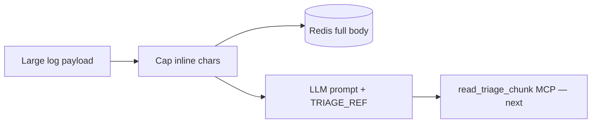
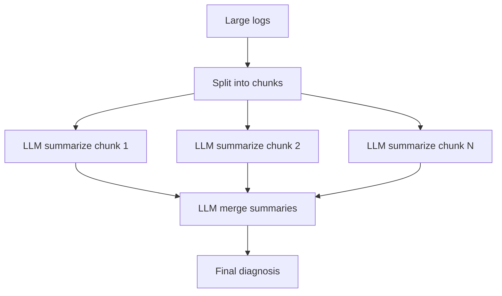
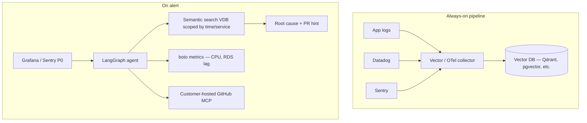
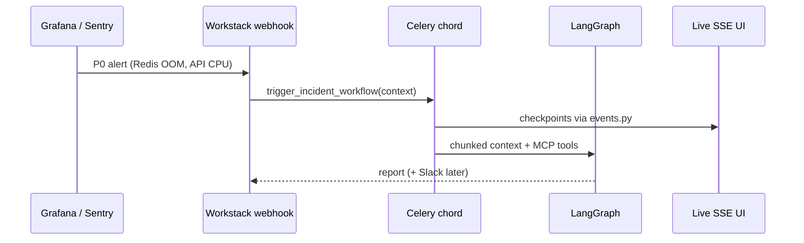

# Incident Triage — Product Research & Architecture Options

Strategy discussion: reusable chunking vs full triage platform, log-ingest patterns, vector DB on the roadmap, and what Workstack validates first.

**Shipped in Workstack today:** `chunking.py`, `events.py`, SSE MCP — see [TRIAGE_PRODUCT.md](TRIAGE_PRODUCT.md).  
**Design Q&A:** [INCIDENT_TRIAGE_QA.md](INCIDENT_TRIAGE_QA.md)

---

## Table of Contents

1. [Two product paths](#1-two-product-paths)
2. [Three patterns: logs → LLM](#2-three-patterns-logs--llm)
3. [What Workstack implements now (Pattern A)](#3-what-workstack-implements-now-pattern-a)
4. [Separate chunking library vs full triage](#4-separate-chunking-library-vs-full-triage)
5. [Vector DB log ingest — roadmap yes or no?](#5-vector-db-log-ingest--roadmap-yes-or-no)
6. [Alert-driven triage (Sentry, Grafana, PagerDuty)](#6-alert-driven-triage-sentry-grafana-pagerduty)
7. [MCP tool fleet (Datadog, Grafana, AWS, GitHub)](#7-mcp-tool-fleet-datadog-grafana-aws-github)
8. [Live UI: SSE now, WebSockets later](#8-live-ui-sse-now-websockets-later)
9. [Ideas to defer (parallel chunk broadcast, etc.)](#9-ideas-to-defer-parallel-chunk-broadcast-etc)
10. [Recommended build sequence](#10-recommended-build-sequence)

---

## 1. Two product paths

| Path | What it is | Audience |
|------|------------|----------|
| **A — Chunking middleware** | `TRIAGE_REF` + Redis refs + MCP `read_triage_chunk` — drop into any MCP/LangGraph stack | Devs hitting context limits today |
| **B — Full triage platform** | Alert in → fetch metrics/logs → agent → report → Slack + live UI | SRE / platform teams (e.g. incident.dev) |

**Recommendation:** Build **A inside Workstack first**, extract to a small library (`mcp_chunking` or similar) once the API stabilizes. Use Workstack as the **integration testbed** for **B** without committing to every integration upfront.

You do **not** need to finish end-to-end triage for all observability stacks before the chunking layer has value. Chunking is the reusable primitive; Datadog/Grafana MCP tools are vertical integrations.

---

## 2. Three patterns: logs → LLM

### Pattern A — Inline cap + reference store (current Workstack)



| Pros | Cons |
|------|------|
| Simple, no extra infra | Agent must call tool to see more (chunk 2) |
| Works with any log source | Dumb splits may cut stack traces mid-line |
| Cheap — Redis only | No semantic “find the error line” |

**Status:** Shipped (`chunking.py`). Next: MCP tool for lazy pull.

---

### Pattern B — Map-reduce (summarize chunks, then merge)



| Pros | Cons |
|------|------|
| Handles very large bodies | **N+1 LLM calls** — cost + latency |
| Each call stays in context | Summaries can **lose** the one critical line |
| Good for executive postmortem drafts | Needs prod incident tuning |

**Verdict:** Useful as **Phase 4 optional mode**, not the default hot path. Run Pattern A first; escalate to map-reduce only when refs + tool pulls are insufficient.

---

### Pattern C — Vector / RAG (continuous ingest)



| Pros | Cons |
|------|------|
| **No cold fetch** from Grafana during incident — logs already indexed | Pipeline ops: embed model, retention, PII scrubbing |
| Semantic search finds relevant lines, not just first 8k chars | Extra cost (vector DB + embeddings) |
| Matches alert-driven product (react to P0, not poll APIs) | Must scope queries by incident window or noise explodes |

**Verdict:** **Yes — add to roadmap** as the mature tier, not the first milestone. Especially valuable when:

- Log volume is high and API export is slow or rate-limited
- Same service fires repeated alerts (reuse indexed window)
- You want “find lines similar to OOM / 502” not sequential chunk scroll

Workstack can start with **API fetchers + Pattern A**, then add **optional vector sidecar** for teams that already stream logs.

---

## 3. What Workstack implements now (Pattern A)

| Module | Role |
|--------|------|
| `chunking.py` | Cap inline prompt; store overflow in Redis; `[TRIAGE_REF]` |
| `events.py` | Live checkpoints for engineers |
| `mcp_client.py` | SSE to persistent HR daemon |
| `tasks.py` | Chord → chunk → LangGraph → MCP |

This is the right **first integration point** for any future `mcp_chunking` package: same hooks, extracted later.

---

## 4. Separate chunking library vs full triage

| Question | Answer |
|----------|--------|
| Build chunking as separate product? | **Yes, eventually** — thin layer: store, ref id, MCP tool, optional LangChain callback |
| Complete full triage for all stacks first? | **No** — too wide; chunking + one real integration (e.g. Datadog) proves the loop |
| Workstack’s role? | Reference deployment + tests before publishing library |

**Library surface (future):**

```python
# Illustrative — not a separate package yet
from mcp_chunking import prepare_for_llm, read_chunk_tool

inline, ref = prepare_for_llm(raw_logs, max_inline=8000)
# Register read_chunk as MCP tool or LangChain tool
```

Workstack keeps `apps/incidents/chunking.py` until the API is stable, then extract.

---

## 5. Vector DB log ingest — roadmap yes or no?

### Your idea

Stream logs from Node/Django, Datadog, Sentry, Grafana into a vector DB **continuously**. On P0 alert, triage queries the index (plus AWS metrics via boto, GitHub via customer MCP) instead of pulling raw logs from Grafana at incident time.

### Assessment

**Useful on the roadmap — with clear phasing.**

| Approach | When it fits |
|----------|--------------|
| **API fetch at triage time** (Phase 2) | Low volume, MVP, Workstack demo, few integrations |
| **Vector ingest always-on** (Phase 5+) | Production SaaS, repeat incidents, semantic search, sub-minute triage SLAs |

**Additions for Pattern C roadmap:**

| Item | Why |
|------|-----|
| **Incident time window** | Every query scoped to `alert fired_at ± N minutes` |
| **Service / env labels** | Metadata on embed — avoid searching all prod history |
| **PII / secret scrubbing** | Before embed — required for multi-tenant product |
| **Dual write** | Raw object store (S3) + vector index — replay and compliance |
| **Hybrid retrieval** | Vector search **+** keyword (grep) for exact error codes |
| **GitHub MCP self-hosted** | Correct — customers run MCP behind their VPC; you get PR/commit metadata only |
| **Embedding refresh policy** | Hot index 7d; cold archive to S3 |

**Do not skip Pattern A:** even with a vector DB, tool responses and MCP payloads can exceed context — chunking/ref handles remain necessary.

---

## 6. Alert-driven triage (Sentry, Grafana, PagerDuty)

Product shape for **incident.dev-style** flow:



Workstack today: **manual trigger** from shell. Next: webhook model + alert payload in `run_id` metadata.

---

## 7. MCP tool fleet (Datadog, Grafana, AWS, GitHub)

| Server | Tools (examples) | Phase |
|--------|------------------|-------|
| `hr_server.py` | `get_employee_manager` | Done |
| `triage_server.py` | `read_triage_chunk` | Next |
| `metrics_server.py` | CloudWatch CPU, RDS lag, Redis memory | Later |
| `observability_server.py` | Datadog query, Grafana Loki logql | Later |
| `github_server.py` | Recent deploys, PR author (customer-hosted) | Later |
| `slack_server.py` | Post to configured channels | Later |

**One daemon per domain** under `mcp_daemons/` — not one mega-server. LangGraph `MultiServerMCPClient` aggregates tools.

Building **all** integrations before chunking + one alert path is unnecessary. Order: **chunk tool → one metrics source → one log source**.

---

## 8. Live UI: SSE now, WebSockets later

| Transport | Use in Workstack |
|-----------|------------------|
| **SSE** (`/api/v1/incidents/runs/<id>/stream/`) | **Now** — one-way checkpoints; matches MCP SSE mental model |
| **WebSockets** | **Later** — human-in-the-loop (“Approve Slack post?”), bidirectional cancel |
| **Next.js frontend** | **Later** — consume SSE or WS; no need to block chunking work |

Real-time AI **token streaming** from Gemini is separate from triage **checkpoint** streaming. Checkpoints = orchestration progress; token stream = optional UX polish.

---

## 9. Ideas to defer (parallel chunk broadcast, etc.)

Concepts from early research **not** planned for near-term Workstack:

| Idea | Why defer |
|------|-----------|
| Multithread chunking with **broadcast stop** when one chunk finds culprit | Needs distributed coordination, race-safe MCP cancellation, heavy testing on prod incidents |
| Map-reduce on every run | Cost and context-loss risk (Pattern B) |
| Full vector pipeline before one working API fetcher | Ops burden before product validation |

Revisit after Pattern A + `read_triage_chunk` + one real alert webhook show measurable time-to-diagnosis.

---

## 10. Recommended build sequence

| Step | Deliverable | Where |
|------|-------------|--------|
| 1 | `read_triage_chunk` MCP tool | `mcp_daemons/` + Workstack agent |
| 2 | Real fetcher (Datadog **or** Grafana) + config YAML | `apps/incidents/` |
| 3 | Alert webhook → `trigger_incident_workflow` | Django view + Celery |
| 4 | Extract stable chunking API | Optional `mcp_chunking` package |
| 5 | Next.js live panel (SSE consumer) | Frontend repo |
| 6 | Vector ingest sidecar + semantic retrieval | New pipeline service; optional for enterprise tier |
| 7 | Map-reduce / parallel search modes | Advanced product tier |

**Current focus:** Step 1–2 inside Workstack. Vector ingest is **roadmap Phase 6**, not a blocker for Steps 1–3.

---

## Summary

| Decision | Recommendation |
|----------|----------------|
| Separate chunking product? | Yes, after Workstack proves API |
| Full triage all stacks first? | No — chunking + one integration loop |
| Vector DB direct log ingest? | **Add to roadmap** — best fit for alert-driven SaaS at scale |
| Pattern A / B / C | **A now**, **B optional later**, **C roadmap tier** |
| Connection pooling MCP client? | **Not a flaw on SSE** — see [INCIDENT_TRIAGE_QA.md](INCIDENT_TRIAGE_QA.md) §6 |

---

[← Triage product](TRIAGE_PRODUCT.md) · [← Q&A](INCIDENT_TRIAGE_QA.md) · [← Agent architecture](AGENT_ARCHITECTURE.md)
