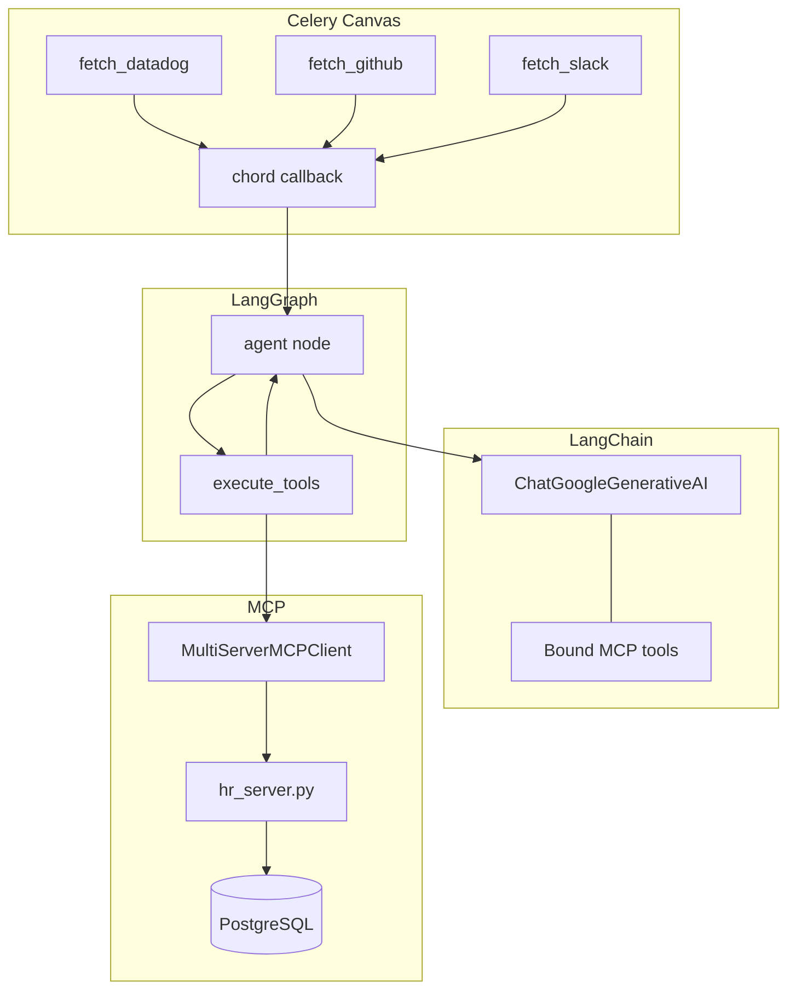
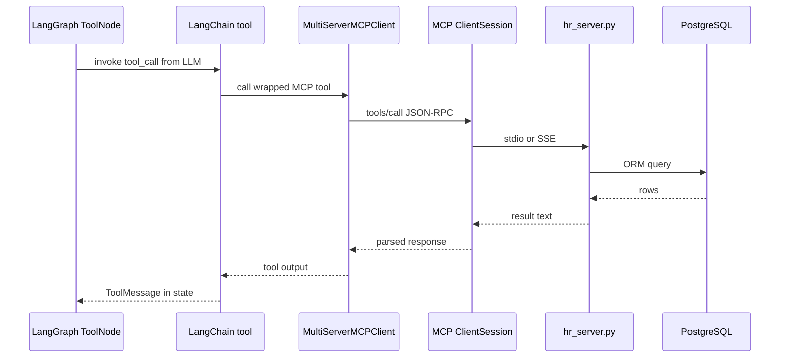

# LangChain + MCP Integration

How `MultiServerMCPClient` connects LangGraph to Workstack MCP servers, and how it compares to the Phase 4 raw MCP SDK.

[← LangGraph](LANGGRAPH_DEEP_DIVE.md) · [Incident agent →](INCIDENT_TRIAGE_AGENT.md)

---

## Table of Contents

1. [Three layers connected](#1-three-layers-connected)
2. [Phase 4 vs Phase 5 — same MCP, different host](#2-phase-4-vs-phase-5--same-mcp-different-host)
3. [MultiServerMCPClient explained](#3-multiservermcpclient-explained)
4. [One server vs many servers](#4-one-server-vs-many-servers)
5. [Raw sse_client vs MultiServerMCPClient](#5-raw-sse_client-vs-multiservermcpclient)
6. [Tool translation pipeline](#6-tool-translation-pipeline)
7. [Production transport choices](#7-production-transport-choices)
8. [Required packages](#8-required-packages)

---

## 1. Three layers connected



| Technology | Role in incident triage |
|------------|-------------------------|
| **Celery Canvas** | Parallel fetch of logs — deterministic, no LLM |
| **LangChain** | Gemini wrapper, tool binding, message types |
| **LangGraph** | Agent ↔ tools loop until done |
| **MCP** | HR lookup tool backed by Django ORM |

---

## 2. Phase 4 vs Phase 5 — same MCP, different host

| | Phase 4 (`organizations/tasks.py`) | Phase 5 (`incidents/tasks.py`) |
|---|-------------------------------------|--------------------------------|
| Host | Hand-written async loop | LangGraph compiled graph |
| MCP client | `mcp.client.sse` or `stdio_client` | `langchain_mcp_adapters.MultiServerMCPClient` |
| LLM SDK | `google.genai` directly | `langchain_google_genai` |
| Tool schema | Hand-written `GET_MANAGER_TOOL` | Auto from MCP via adapter |
| Pre-fetch logs | No | Yes — Celery chord |

**Same MCP server** (`mcp_daemons/hr_server.py`) serves both. Phase 4 does not require LangChain. Phase 5 does not replace MCP — it **wraps** MCP for LangGraph.

---

## 3. MultiServerMCPClient explained

Current code in `apps/incidents/tasks.py` uses a **configuration dictionary** (langchain-mcp-adapters 0.3.x):

```python
mcp_client = MultiServerMCPClient(
    {
        "workstack_hr": {
            "command": "python",
            "args": [server_path],
            "transport": "stdio",   # <-- current: spawns subprocess
        }
    }
)
mcp_tools = await mcp_client.get_tools()
```

| Key | Meaning |
|-----|---------|
| `"workstack_hr"` | Logical server name (arbitrary label) |
| `"command"` + `"args"` | OS subprocess to spawn MCP server (stdio) |
| `"transport": "stdio"` | Talk over stdin/stdout pipes |
| `get_tools()` | Returns LangChain tools from **all** entries in the dict |

Add more servers by adding more keys to the same dict — no need for multiple client instances.

**Older API note:** Some examples use `await mcp_client.connect_to_server(...)`. Workstack uses the dict constructor above, which is equivalent: one dict entry = one MCP server connection.

---

## 4. One server vs many servers

### Multiple servers in one dict

```python
mcp_client = MultiServerMCPClient(
    {
        "workstack_hr": {
            "command": "python",
            "args": [hr_server_path],
            "transport": "stdio",
        },
        "jira_tools": {
            "command": "python",
            "args": [jira_server_path],
            "transport": "stdio",
        },
    }
)
all_tools = await mcp_client.get_tools()
# Merged tools from HR + Jira servers
```

Each dict entry = **one MCP server process** (stdio) or **one SSE endpoint**, not one tool.

### One server, many tools

If `hr_server.py` exposes three `@mcp.tool()` functions, **one** dict entry returns **three** LangChain tools.

| Dict entries | Tools returned |
|--------------|----------------|
| 1 server, 2 `@mcp.tool()` | 2 tools |
| 3 servers, 1 tool each | 3 tools |
| 3 servers, 2 tools each | 6 tools |

LLM sees a flat tool list; `get_tools()` merges all namespaces.

---

## 5. Raw sse_client vs MultiServerMCPClient

| | Raw MCP SDK (`sse_client` / `stdio_client`) | `MultiServerMCPClient` |
|---|---------------------------------------------|------------------------|
| Purpose | Direct JSON-RPC to MCP | LangChain/LangGraph integration |
| Tool format | MCP schema | LangChain `StructuredTool` |
| Multi-server | Manual multiple sessions | Built-in merge |
| LLM binding | You map schema → Gemini | `bind_tools(mcp_tools)` automatic |
| Best for | Testing MCP, Phase 4 learning | LangGraph agents |

**Neither is "better"** — different abstraction layers. Production agent code uses the adapter; debugging MCP uses raw client (see `test_mcp_sse.py`).

---

## 6. Tool translation pipeline



Steps:

1. LLM emits `tool_calls` in agent node
2. `ToolNode` dispatches to matching LangChain tool
3. Adapter forwards to MCP server
4. Result appended to `messages`; graph routes back to agent node

---

## 7. Production transport: stdio vs SSE

**Yes — current `_async_agent_execution` uses stdio, not SSE.**

The agent task uses `MultiServerMCPClient`, but with `"transport": "stdio"`. That means **every triage run spawns a new Python subprocess** running `hr_server.py` (same boot cost as Phase 4 stdio).

| Transport | What happens | When to use |
|-----------|--------------|-------------|
| **`stdio`** (current) | Celery task forks `python hr_server.py`; OS pipes | Dev, demos, proving the loop |
| **`sse`** (production) | HTTP to already-running `workstack_mcp_hr:8080` | Production — warm daemon, no Django boot per task |

Both use `MultiServerMCPClient` — only the **transport key** in the config dict changes.

### Current code — stdio (dev)

```python
# apps/incidents/tasks.py — stdio subprocess (dev / Celery agent)
mcp_client = MultiServerMCPClient(
    {
        "workstack_hr": {
            "command": "python",
            "args": [server_path, "--transport", "stdio"],
            "transport": "stdio",
        }
    }
)
```

**Critical:** `hr_server.py` defaults to **SSE mode** when run bare (`python hr_server.py`). Spawning it without `--transport stdio` prints `"Starting MCP SSE Daemon..."` to **stdout**, which breaks the JSON-RPC stdio parser.

| Run command | Mode |
|-------------|------|
| `python hr_server.py` | SSE daemon (Docker) |
| `python hr_server.py --transport stdio` | stdio subprocess (Celery agent) |

Flow: LangGraph `ToolNode` → adapter → **spawn subprocess** → MCP JSON-RPC over pipes → PostgreSQL.

### Production code — SSE (recommended)

Requires `mcp_hr_daemon` running (`docker compose up mcp_hr_daemon`).

```python
# Production swap — no subprocess spawn
mcp_client = MultiServerMCPClient(
    {
        "workstack_hr": {
            "url": "http://workstack_mcp_hr:8080/sse",
            "transport": "sse",
        }
    }
)
mcp_tools = await mcp_client.get_tools()
```

Flow: LangGraph `ToolNode` → adapter → **HTTP/SSE** to persistent daemon → PostgreSQL.

| | stdio in agent task | SSE in agent task |
|---|---------------------|-------------------|
| Uses MultiServerMCPClient? | Yes | Yes |
| Spawns hr_server.py each run? | Yes | No |
| Needs mcp_hr_daemon container? | No | Yes |
| Same tools exposed? | Yes | Yes |

See [MCP_SSE_HTTP.md](MCP_SSE_HTTP.md) for daemon setup and testing.

---

## 8. Required packages

Pinned in `backend/requirements/base.txt`:

```text
langchain-core~=1.4.8
langchain-google-genai~=4.2.5
langchain-mcp-adapters~=0.3.0
langgraph~=1.2.6
```

### Why `~=` instead of `>=`?

LangChain, LangGraph, and MCP adapters release **breaking changes frequently**. Using `>=` can pull a incompatible major version on the next Docker build.

| Operator | Behavior |
|----------|----------|
| `>=1.4.8` | Any newer version — risky |
| `~=1.4.8` | `>=1.4.8, <1.5.0` — patch/minor fixes only |
| `==1.4.8` | Locked exactly — safest for reproducible builds |

### Transitive dependencies (do not pin manually)

These install automatically via pip when you install the four packages above:

- `langgraph-checkpoint`, `langgraph-prebuilt`, `langgraph-sdk`
- `langchain-protocol`
- `langsmith`

Only add them to `requirements.txt` if you import them directly.

After changing requirements:

```bash
docker compose build web celery
docker compose up -d
```

---

## Summary

| Question | Answer |
|----------|--------|
| Does MultiServerMCPClient break 1:1 client-server rule? | No — it **manages multiple** 1:1 sessions for you |
| 3× connect_to_server | 3 dict entries; `get_tools()` merges all |
| Replace organizations Phase 4? | No — keep both; different abstraction levels |
| MCP + LangGraph together? | **Yes** — standard production agent stack |
| Current agent uses SSE? | **No** — uses `transport: stdio`; swap to SSE for production |

---

[← LangGraph](LANGGRAPH_DEEP_DIVE.md) · [Run & test →](INCIDENT_TRIAGE_AGENT.md) · [MCP SSE →](MCP_SSE_HTTP.md)
