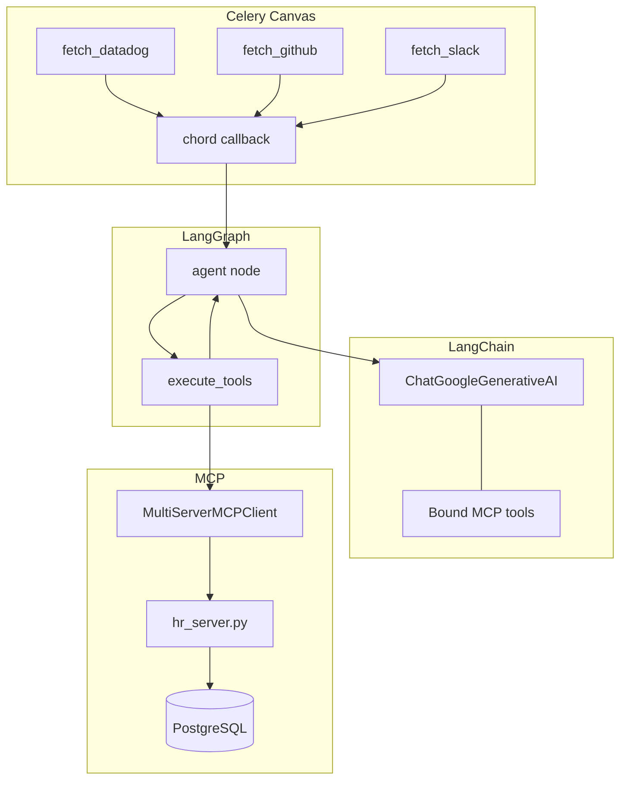
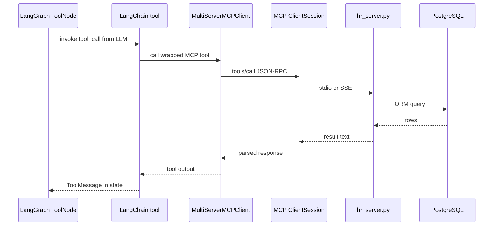

# LangChain + MCP Integration

How `MultiServerMCPClient` connects LangGraph to Workstack MCP servers, and how it compares to the Phase 4 raw MCP SDK.

[← LangGraph](LANGGRAPH_DEEP_DIVE.md) · [Incident agent →](INCIDENT_TRIAGE_AGENT.md)

---

## Table of Contents

1. [Three layers connected](#1-three-layers-connected)
2. [Phase 4 vs Phase 5 — same MCP, different host](#2-phase-4-vs-phase-5--same-mcp-different-host)
3. [MultiServerMCPClient explained](#3-multiservermcpclient-explained)
4. [One server vs many servers](#4-one-server-vs-many-servers)
5. [Raw sse_client vs MultiServerMCPClient](#5-raw-sse_client-vs-multiservermcpclient)
6. [Tool translation pipeline](#6-tool-translation-pipeline)
7. [Production transport choices](#7-production-transport-choices)
8. [Required packages](#8-required-packages)

---

## 1. Three layers connected



| Technology | Role in incident triage |
|------------|-------------------------|
| **Celery Canvas** | Parallel fetch of logs — deterministic, no LLM |
| **LangChain** | Gemini wrapper, tool binding, message types |
| **LangGraph** | Agent ↔ tools loop until done |
| **MCP** | HR lookup tool backed by Django ORM |

---

## 2. Phase 4 vs Phase 5 — same MCP, different host

| | Phase 4 (`organizations/tasks.py`) | Phase 5 (`incidents/tasks.py`) |
|---|-------------------------------------|--------------------------------|
| Host | Hand-written async loop | LangGraph compiled graph |
| MCP client | `mcp.client.sse` or `stdio_client` | `langchain_mcp_adapters.MultiServerMCPClient` |
| LLM SDK | `google.genai` directly | `langchain_google_genai` |
| Tool schema | Hand-written `GET_MANAGER_TOOL` | Auto from MCP via adapter |
| Pre-fetch logs | No | Yes — Celery chord |

**Same MCP server** (`mcp_daemons/hr_server.py`) serves both. Phase 4 does not require LangChain. Phase 5 does not replace MCP — it **wraps** MCP for LangGraph.

---

## 3. MultiServerMCPClient explained

From `langchain_mcp_adapters`:

```python
async with MultiServerMCPClient() as mcp_client:
    await mcp_client.connect_to_server(
        "workstack_hr",
        command="python",
        args=[server_path],
    )
    mcp_tools = mcp_client.get_tools()
```

| Method | What it does |
|--------|----------------|
| `connect_to_server(name, ...)` | Spawns **one MCP server process** (stdio) or connects via URL (SSE) |
| `get_tools()` | Returns **all tools** from **all connected servers** as LangChain tools |
| Context manager | Cleans up subprocesses / connections on exit |

**"MultiServer"** solves the Phase 4 limitation where one `ClientSession` ↔ one server. You can connect multiple named servers and merge their tools.

---

## 4. One server vs many servers

### Multiple calls = multiple servers

```python
await mcp_client.connect_to_server("workstack_hr", command="python", args=[hr_path])
await mcp_client.connect_to_server("jira", command="python", args=[jira_path])
await mcp_client.connect_to_server("slack", command="python", args=[slack_path])

all_tools = mcp_client.get_tools()
# Contains tools from HR + Jira + Slack servers
```

Each `connect_to_server` = **one MCP server process** (or one SSE endpoint), not "one tool".

### One server, many tools

If `hr_server.py` exposes three `@mcp.tool()` functions, **one** `connect_to_server` returns **three** LangChain tools.

| connect_to_server calls | Tools returned |
|-------------------------|----------------|
| 1 server, 2 `@mcp.tool()` | 2 tools |
| 3 servers, 1 tool each | 3 tools |
| 3 servers, 2 tools each | 6 tools |

LLM sees flat tool list; `get_tools()` merges namespaces.

---

## 5. Raw sse_client vs MultiServerMCPClient

| | Raw MCP SDK (`sse_client` / `stdio_client`) | `MultiServerMCPClient` |
|---|---------------------------------------------|------------------------|
| Purpose | Direct JSON-RPC to MCP | LangChain/LangGraph integration |
| Tool format | MCP schema | LangChain `StructuredTool` |
| Multi-server | Manual multiple sessions | Built-in merge |
| LLM binding | You map schema → Gemini | `bind_tools(mcp_tools)` automatic |
| Best for | Testing MCP, Phase 4 learning | LangGraph agents |

**Neither is "better"** — different abstraction layers. Production agent code uses the adapter; debugging MCP uses raw client (see `test_mcp_sse.py`).

---

## 6. Tool translation pipeline



Steps:

1. LLM emits `tool_calls` in agent node
2. `ToolNode` dispatches to matching LangChain tool
3. Adapter forwards to MCP server
4. Result appended to `messages`; graph routes back to agent node

---

## 7. Production transport choices

| Environment | MCP connection in agent task |
|-------------|------------------------------|
| **Dev / interview demo** | stdio spawn `hr_server.py` (current code) |
| **Production** | SSE URL `http://workstack_mcp_hr:8080/sse` — no subprocess boot |

Example SSE connect (when adapter supports URL transport):

```python
await mcp_client.connect_to_server(
    "workstack_hr",
    url="http://workstack_mcp_hr:8080/sse",
)
```

Keep `mcp_hr_daemon` running in Docker. Agent task becomes HTTP client only — same pattern as [MCP_SSE_HTTP.md](MCP_SSE_HTTP.md).

---

## 8. Required packages

Add to `backend/requirements/base.txt` (or local.txt):

```
langchain-core>=0.3
langchain-google-genai>=2.0
langgraph>=0.2
langchain-mcp-adapters>=0.1
```

Verify versions compatible with existing `google-genai` and `mcp` packages.

---

## Summary

| Question | Answer |
|----------|--------|
| Does MultiServerMCPClient break 1:1 client-server rule? | No — it **manages multiple** 1:1 sessions for you |
| 3× connect_to_server | 3 servers; `get_tools()` merges all |
| Replace organizations Phase 4? | No — keep both; different abstraction levels |
| MCP + LangGraph together? | **Yes** — standard production agent stack |

---

[← LangGraph](LANGGRAPH_DEEP_DIVE.md) · [Run & test →](INCIDENT_TRIAGE_AGENT.md) · [MCP SSE →](MCP_SSE_HTTP.md)
