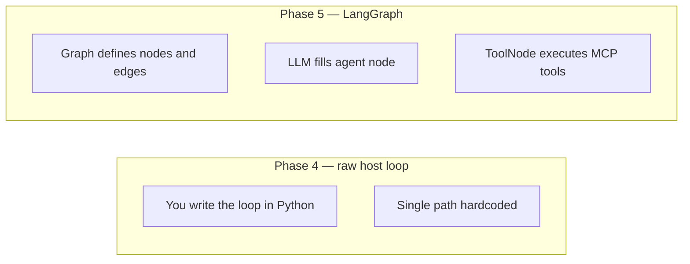
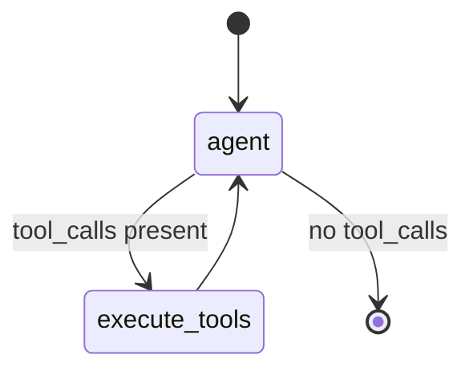

# LangGraph Deep Dive

What LangGraph is, how it differs from a raw MCP ReAct loop, and who makes decisions in the graph.

[← Agent Architecture](AGENT_ARCHITECTURE.md) · [LangChain + MCP →](LANGCHAIN_MCP_INTEGRATION.md)

---

## Table of Contents

1. [Is LangGraph a trending AI agent?](#1-is-langgraph-a-trending-ai-agent)
2. [Raw script vs LangGraph graph](#2-raw-script-vs-langgraph-graph)
3. [Who decides — LLM or graph?](#3-who-decides--llm-or-graph)
4. [Nodes, edges, and conditional routing](#4-nodes-edges-and-conditional-routing)
5. [ReAct loop vs state machine](#5-react-loop-vs-state-machine)
6. [Line-by-line: incidents agent graph](#6-line-by-line-incidents-agent-graph)
7. [When you need LangGraph vs when you don't](#7-when-you-need-langgraph-vs-when-you-dont)
8. [FAQ](#8-faq)

---

## 1. Is LangGraph a trending AI agent?

**LangGraph is not an agent by itself.** It is a **state-machine framework** for building agents — widely used in production AI systems in 2024–2026 alongside LangChain, CrewAI, and custom orchestrators.

| Term | Meaning |
|------|---------|
| **AI agent** | LLM + tools + loop that acts until a goal is met |
| **LangChain** | Toolkit — prompts, model bindings, tool interfaces |
| **LangGraph** | Graph runtime — nodes, edges, persistence, branching |

Market pattern: teams wrap **Gemini / OpenAI** in **LangGraph** when flows need more than one LLM→tool→LLM cycle or require **explicit control** (human approval, retries, fallbacks).

---

## 2. Raw script vs LangGraph graph

### Phase 4 — "raw" host script (`organizations/tasks.py`)

Not literally "no MCP client" — it uses the official MCP Python SDK. "Raw" means **no LangChain/LangGraph abstraction**:

```
Prompt → Gemini → function_call → mcp_session.call_tool → Gemini → text
```

One hand-written loop in Python. Works for **one tool, one goal**.

### Phase 5 — LangGraph (`incidents/tasks.py`)

```
Prompt → [agent node] → tool_calls? → [execute_tools node] → [agent node] → ... → END
```

The **graph** defines allowed paths. The **LLM** chooses tools inside the agent node.



| | Phase 4 raw loop | Phase 5 LangGraph |
|---|------------------|-------------------|
| Loop logic | Your `if response.function_calls` | Graph edges + `should_continue` |
| Tool execution | `call_tool` manually | `ToolNode` |
| Add human approval step | Rewrite Python | Add a node + edge |
| Persist conversation state | DIY | Built-in checkpointers |
| Multiple MCP servers | Multiple clients DIY | `MultiServerMCPClient` |

---

## 3. Who decides — LLM or graph?

**Both — different layers.**

| Decision | Who |
|----------|-----|
| "Call `get_employee_manager` with this email" | **LLM** (inside agent node) |
| "After tools, go back to agent or stop" | **Graph** (`should_continue` function) |
| "Run Datadog + GitHub + Slack in parallel first" | **Celery chord** (not LLM) |
| "Maximum tool iterations" | **Graph** (you can cap edges) |
| "Route high severity to human" | **Graph** (conditional edge you define — not in basic demo) |

The LLM does **not** draw the graph. You define the **allowed moves**; the LLM picks **which tool** when the agent node runs.

---

## 4. Nodes, edges, and conditional routing



In code (`apps/incidents/tasks.py`):

| Piece | Role |
|-------|------|
| `AgentState` | Typed dict holding `messages` list |
| `call_model` | Node — invokes LLM with bound tools |
| `should_continue` | Router — reads last message for `tool_calls` |
| `ToolNode` | Node — runs MCP tools LangChain extracted |
| `workflow.compile()` | Runnable graph |

**Why nodes if the LLM decides tools anyway?**

Nodes encode **workflow structure** the LLM cannot safely invent:

- Mandatory audit step before external action
- Human-in-the-loop approval node
- Fallback node when tool errors
- Separate "summarize" vs "act" nodes with different prompts

ReAct (Reason + Act) is **one pattern** LangGraph can express. The graph generalizes to **any** state machine.

---

## 5. ReAct loop vs state machine

| ReAct (Phase 4 style) | LangGraph state machine |
|-----------------------|-------------------------|
| Implicit loop in code | Explicit nodes and edges |
| One agent behavior | Multiple behaviors in one graph |
| Hard to pause/resume | Checkpointing support |
| Fine for 1–2 tools | Scales to complex enterprise flows |

**Similarity:** Both use LLM → tool → LLM.  
**Difference:** LangGraph makes the **control flow visible and editable** without rewriting imperative loops.

---

## 6. Line-by-line: incidents agent graph

File: `backend/apps/incidents/tasks.py`

### State

```python
class AgentState(TypedDict):
    messages: List[BaseMessage]
```

LangGraph passes this dict between nodes. Each node returns partial updates (e.g. new messages appended).

### Celery callback entry

```python
@shared_task
def run_mcp_enhanced_triage(aggregated_logs, server_id):
    return asyncio.run(_async_agent_execution(aggregated_logs, server_id))
```

Runs **after** chord gatherers finish. `aggregated_logs` is a list of the three fetcher dicts.

### MCP + LangChain setup

```python
async with MultiServerMCPClient() as mcp_client:
    await mcp_client.connect_to_server("workstack_hr", command="python", args=[server_path])
    mcp_tools = mcp_client.get_tools()
```

Spawns `hr_server.py` via stdio inside the agent task. See [LANGCHAIN_MCP_INTEGRATION.md](LANGCHAIN_MCP_INTEGRATION.md) for SSE production path.

### Bind tools to LLM

```python
tool_node = ToolNode(mcp_tools)
llm_with_tools = llm.bind_tools(mcp_tools)
```

`ToolNode` knows how to execute LangChain-wrapped MCP tools when the LLM emits `tool_calls`.

### Agent node

```python
def call_model(state: AgentState):
    return {"messages": [llm_with_tools.invoke(state["messages"])]}
```

Calls Gemini with full message history. May return text **or** tool_calls.

### Router

```python
def should_continue(state: AgentState):
    if state["messages"][-1].tool_calls:
        return "execute_tools"
    return END
```

**Graph decision** — not LLM — to loop or finish.

### Graph wiring

```python
workflow.add_node("agent", call_model)
workflow.add_node("execute_tools", tool_node)
workflow.set_entry_point("agent")
workflow.add_conditional_edges("agent", should_continue)
workflow.add_edge("execute_tools", "agent")
app = workflow.compile()
```

Classic **agent ↔ tools** cycle until LLM responds without tool_calls.

### Invoke

```python
final_output = await app.ainvoke({"messages": [HumanMessage(content=prompt)]})
```

Prompt includes pre-fetched logs from Celery — agent does not need MCP to fetch Datadog/GitHub/Slack.

---

## 7. When you need LangGraph vs when you don't

| Use case | Recommendation |
|----------|----------------|
| Single tool lookup (manager by email) | Phase 4 raw loop — sufficient |
| Multi-tool incident triage | LangGraph + MCP |
| Human approval before Slack post | LangGraph — add node |
| Voice bot real-time loop | Different stack (WebSocket + streaming) |
| Parallel API fetch, no mid-flight tools | Celery only — no LangGraph |

---

## 8. FAQ

### Is Phase 4 MCP demo-only?

No. It is a **valid production pattern** for simple tool calls. LangGraph adds **structure** when complexity grows.

### Can multiple MCP client/server pairs run without LangGraph?

Yes. Phase 4 proves that. LangGraph organizes **orchestration**, not MCP transport.

### Is MCP or LangGraph "better"?

**Neither replaces the other.**

| Layer | Role |
|-------|------|
| **MCP** | Standard tool wire protocol + isolated servers |
| **LangChain** | Model + tool adapters |
| **LangGraph** | Agent control flow |
| **Celery** | Distributed deterministic I/O |

Complete agentic workflow = **combine all four** for enterprise patterns.

---

[← Architecture](AGENT_ARCHITECTURE.md) · [LangChain + MCP →](LANGCHAIN_MCP_INTEGRATION.md) · [Test guide →](INCIDENT_TRIAGE_AGENT.md)
