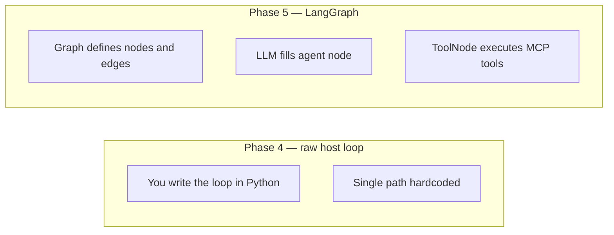
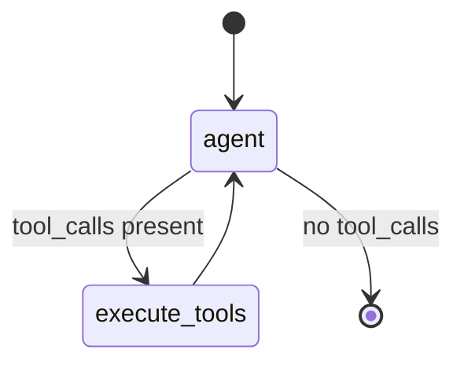
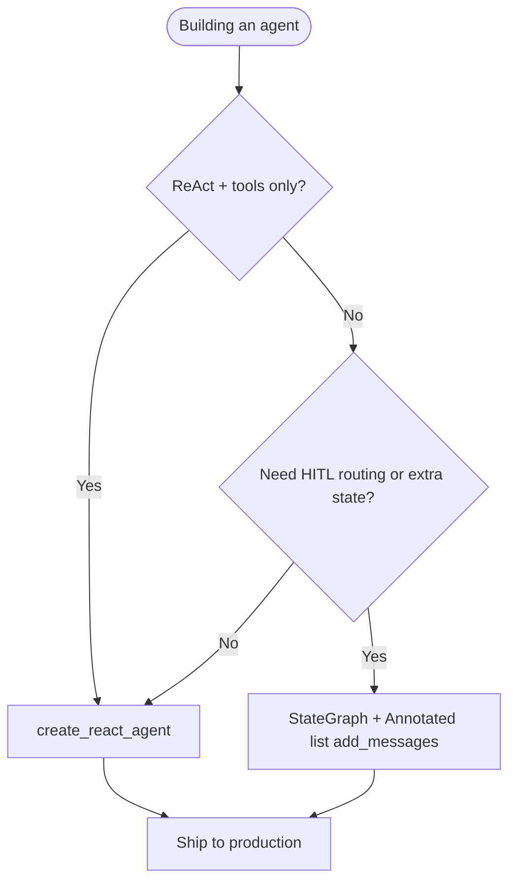

# LangGraph Deep Dive

What LangGraph is, how it differs from a raw MCP ReAct loop, and who makes decisions in the graph.

[← Agent Architecture](AGENT_ARCHITECTURE.md) · [LangChain + MCP →](LANGCHAIN_MCP_INTEGRATION.md)

---

## Table of Contents

1. [Is LangGraph a trending AI agent?](#1-is-langgraph-a-trending-ai-agent)
2. [Raw script vs LangGraph graph](#2-raw-script-vs-langgraph-graph)
3. [Who decides — LLM or graph?](#3-who-decides--llm-or-graph)
4. [Nodes, edges, and conditional routing](#4-nodes-edges-and-conditional-routing)
5. [ReAct loop vs state machine](#5-react-loop-vs-state-machine)
6. [Workstack incidents agent (current code)](#6-workstack-incidents-agent-current-code)
7. [When to use `create_react_agent` vs `add_messages`](#7-when-to-use-create_react_agent-vs-add_messages)
8. [Manual graph with `add_messages` (full reference)](#8-manual-graph-with-add_messages-full-reference)
9. [When you need LangGraph vs when you don't](#9-when-you-need-langgraph-vs-when-you-dont)
10. [FAQ](#10-faq)

---

## 1. Is LangGraph a trending AI agent?

**LangGraph is not an agent by itself.** It is a **state-machine framework** for building agents — widely used in production AI systems in 2024–2026 alongside LangChain, CrewAI, and custom orchestrators.

| Term | Meaning |
|------|---------|
| **AI agent** | LLM + tools + loop that acts until a goal is met |
| **LangChain** | Toolkit — prompts, model bindings, tool interfaces |
| **LangGraph** | Graph runtime — nodes, edges, persistence, branching |

Market pattern: teams wrap **Gemini / OpenAI** in **LangGraph** when flows need more than one LLM→tool→LLM cycle or require **explicit control** (human approval, retries, fallbacks).

---

## 2. Raw script vs LangGraph graph

### Phase 4 — "raw" host script (`organizations/tasks.py`)

Not literally "no MCP client" — it uses the official MCP Python SDK. "Raw" means **no LangChain/LangGraph abstraction**:

```
Prompt → Gemini → function_call → mcp_session.call_tool → Gemini → text
```

One hand-written loop in Python. Works for **one tool, one goal**.

### Phase 5 — LangGraph (`incidents/tasks.py`)

```
Prompt → [agent node] → tool_calls? → [execute_tools node] → [agent node] → ... → END
```

The **graph** defines allowed paths. The **LLM** chooses tools inside the agent node.



| | Phase 4 raw loop | Phase 5 LangGraph |
|---|------------------|-------------------|
| Loop logic | Your `if response.function_calls` | Graph edges + `should_continue` |
| Tool execution | `call_tool` manually | `ToolNode` |
| Add human approval step | Rewrite Python | Add a node + edge |
| Persist conversation state | DIY | Built-in checkpointers |
| Multiple MCP servers | Multiple clients DIY | `MultiServerMCPClient` |

---

## 3. Who decides — LLM or graph?

**Both — different layers.**

| Decision | Who |
|----------|-----|
| "Call `get_employee_manager` with this email" | **LLM** (inside agent node) |
| "After tools, go back to agent or stop" | **Graph** (`should_continue` function) |
| "Run Datadog + GitHub + Slack in parallel first" | **Celery chord** (not LLM) |
| "Maximum tool iterations" | **Graph** (you can cap edges) |
| "Route high severity to human" | **Graph** (conditional edge you define — not in basic demo) |

The LLM does **not** draw the graph. You define the **allowed moves**; the LLM picks **which tool** when the agent node runs.

---

## 4. Nodes, edges, and conditional routing



In code (`apps/incidents/tasks.py` today):

| Piece | Role |
|-------|------|
| `create_react_agent(llm, tools)` | Prebuilt graph — agent + ToolNode + `add_messages` |
| `agent.ainvoke(...)` | Runs full ReAct loop until LLM stops calling tools |

For a **manual** graph (commented in `tasks.py`), the same roles map to `AgentState`, `call_model`, `should_continue`, and `ToolNode`. See [§7](#7-when-to-use-create_react_agent-vs-add_messages) and [§8](#8-manual-graph-with-add_messages-full-reference).

**Why nodes if the LLM decides tools anyway?**

Nodes encode **workflow structure** the LLM cannot safely invent:

- Mandatory audit step before external action
- Human-in-the-loop approval node
- Fallback node when tool errors
- Separate "summarize" vs "act" nodes with different prompts

ReAct (Reason + Act) is **one pattern** LangGraph can express. The graph generalizes to **any** state machine.

---

## 5. ReAct loop vs state machine

| ReAct (Phase 4 style) | LangGraph state machine |
|-----------------------|-------------------------|
| Implicit loop in code | Explicit nodes and edges |
| One agent behavior | Multiple behaviors in one graph |
| Hard to pause/resume | Checkpointing support |
| Fine for 1–2 tools | Scales to complex enterprise flows |

**Similarity:** Both use LLM → tool → LLM.  
**Difference:** LangGraph makes the **control flow visible and editable** without rewriting imperative loops.

---

## 6. Workstack incidents agent (current code)

File: `backend/apps/incidents/tasks.py`

Workstack uses **`create_react_agent`** — LangGraph's prebuilt ReAct loop — not a hand-wired `StateGraph`:

```python
from langgraph.prebuilt import create_react_agent

mcp_tools = await mcp_client.get_tools()
agent = create_react_agent(llm, mcp_tools)
final_state = await agent.ainvoke({"messages": [HumanMessage(content=prompt)]})
```

Under the hood, `create_react_agent` already uses **`MessagesState` with the `add_messages` reducer** — so message history is **appended**, not overwritten.

---

## 7. When to use `create_react_agent` vs `add_messages`

Both solve the same core problem: **keeping full conversation history** across agent and tool nodes. The difference is *who wires it* — LangGraph maintainers or you.

### The memory wipe bug (why `add_messages` exists)

LangGraph state updates are **merges** by default. For a plain list field, merge means **replace**:

```python
# BROKEN for multi-turn agents — do not use without a reducer
class AgentState(TypedDict):
    messages: list
```

| Step | Node output | State after update | Problem |
|------|---------------|-------------------|---------|
| 1 | `[HumanMessage(prompt)]` | `[Human]` | OK |
| 2 | `[AIMessage(tool_calls=...)]` | `[AI]` only | **Prompt deleted** |
| 3 | `[ToolMessage(result)]` | `[Tool]` only | **AI call deleted** |
| 4 | Agent calls Gemini | `[Tool]` alone | `ValueError: contents are required` |

The LLM wakes up with a raw DB row and zero conversational context.

### What `add_messages` does

```python
from typing import Annotated
from langgraph.graph.message import add_messages

class AgentState(TypedDict):
    messages: Annotated[list, add_messages]
```

Each node returns **new** messages; LangGraph **appends** them:

```
[Human prompt] → [Human, AI tool_call] → [Human, AI, Tool result] → [Human, AI, Tool, AI reply]
```

That is the minimum requirement for any multi-turn tool agent.

---

### Option A — `create_react_agent` (Workstack production default)

**What it is:** LangGraph's prebuilt ReAct agent — a compiled graph with agent node, `ToolNode`, conditional edges, and **`add_messages` already configured**.

```python
from langgraph.prebuilt import create_react_agent

agent = create_react_agent(llm, mcp_tools)
final_state = await agent.ainvoke({"messages": [HumanMessage(content=prompt)]})
```

**Why use it:**

| Reason | Detail |
|--------|--------|
| Correct message history | `add_messages` built-in — no wipe bug |
| Less code | ~3 lines vs ~40 for equivalent manual graph |
| Maintained by LangGraph | Survives SDK upgrades; fewer Gemini formatting edge cases |
| Team readability | New engineers recognize standard ReAct pattern |
| Production default | What most teams ship for "LLM + tools until done" |

**When to use it:**

- Standard **Reason → Act → Observe → Reason** loop
- One LLM decides which MCP tool to call
- No extra workflow nodes yet (no approval gates, no severity branches)
- **Workstack incident triage today** — fetch logs via Celery, reason via ReAct + MCP

**When you have outgrown it:**

- Need a **human approval node** before external actions
- Need **conditional routing** the prebuilt agent cannot express
- Need **extra state** (`severity`, `approved`, `incident_id`) alongside messages

---

### Option B — Manual `StateGraph` + `add_messages`

**What it is:** You define nodes, edges, and state yourself — but **must** use `Annotated[list, add_messages]` on the messages field.

**Why use it:**

| Reason | Detail |
|--------|--------|
| Custom workflow | Nodes that are not plain ReAct (classify → approve → act) |
| Human-in-the-loop | Pause graph until operator approves |
| Extra state fields | `severity: str`, `approved: bool` in same `TypedDict` |
| Explicit control | You own every edge and retry policy |

**When to use it:**

- Incident severity **critical** → route to `human_approval` node before Slack
- Separate **summarize** node with a cheap model, **act** node with tools
- Compliance requires **auditable graph** with named steps
- You need **checkpointing** with custom interrupt points

**When not to use it:**

- Simple ReAct + tools only — use `create_react_agent` instead
- Team lacks LangGraph experience — manual graphs add maintenance cost

---

### Side-by-side decision table

| Question | `create_react_agent` | Manual + `add_messages` |
|----------|---------------------|-------------------------|
| ReAct loop only? | **Yes — use this** | Unnecessary complexity |
| Custom nodes beyond ReAct? | No | **Yes — use this** |
| Who configures `add_messages`? | LangGraph (internal) | **You (required)** |
| Risk of memory wipe bug? | Low | High if you forget reducer |
| Lines of agent code | ~5 | ~40+ |
| Workstack Phase 5 now | **Active in `tasks.py`** | Commented reference only |



### Workstack roadmap

| Phase | Agent pattern |
|-------|---------------|
| **Now** | `create_react_agent` + Celery chord + MCP stdio |
| **Next** | Manual graph + `add_messages` when adding approval/routing nodes |
| **Production MCP** | SSE URL to `mcp_hr_daemon` (see LANGCHAIN_MCP_INTEGRATION.md) |

**Verdict:** `add_messages` is **required knowledge** for any LangGraph agent. **`create_react_agent` is the right default** because it applies that knowledge for you. Switch to manual graph + `add_messages` when workflow requirements exceed ReAct.

---

## 8. Manual graph with `add_messages` (full reference)

This matches the **commented block** in `backend/apps/incidents/tasks.py`. Uncomment and remove `create_react_agent` only when you need custom nodes.

```python
from typing import Annotated, TypedDict
from langgraph.graph import StateGraph, END
from langgraph.graph.message import add_messages
from langgraph.prebuilt import ToolNode
from langchain_core.messages import AIMessage, HumanMessage

class AgentState(TypedDict):
    # CRITICAL: Annotated + add_messages appends history; plain list replaces it
    messages: Annotated[list, add_messages]

tool_node = ToolNode(mcp_tools)
llm_with_tools = llm.bind_tools(mcp_tools)

async def call_model(state: AgentState):
    response = await llm_with_tools.ainvoke(state["messages"])
    return {"messages": [response]}

def should_continue(state: AgentState):
    last = state["messages"][-1]
    if isinstance(last, AIMessage) and last.tool_calls:
        return "execute_tools"
    return END

workflow = StateGraph(AgentState)
workflow.add_node("agent", call_model)
workflow.add_node("execute_tools", tool_node)
workflow.set_entry_point("agent")
workflow.add_conditional_edges("agent", should_continue)
workflow.add_edge("execute_tools", "agent")

app = workflow.compile()
final_state = await app.ainvoke({"messages": [HumanMessage(content=prompt)]})
```

### Example: when you add a custom approval node (future)

```python
class AgentState(TypedDict):
    messages: Annotated[list, add_messages]
    approved: bool  # extra field — why manual graph beats create_react_agent

async def human_approval(state: AgentState):
    # Block until ops approves in UI / DB flag
    ...

workflow.add_node("human_approval", human_approval)
workflow.add_conditional_edges("agent", route_by_severity)  # not plain ReAct
```

`create_react_agent` cannot express this without replacing the whole graph — that is the migration trigger.

Compare to Phase 4 raw loop in `organizations/tasks.py` — same ReAct *idea*, different orchestration layer.

---

## 9. When you need LangGraph vs when you don't

| Use case | Recommendation |
|----------|----------------|
| Single tool lookup (manager by email) | Phase 4 raw loop — sufficient |
| Multi-tool incident triage | LangGraph + MCP |
| Human approval before Slack post | LangGraph — add node |
| Voice bot real-time loop | Different stack (WebSocket + streaming) |
| Parallel API fetch, no mid-flight tools | Celery only — no LangGraph |

---

## 10. FAQ

### Is Phase 4 MCP demo-only?

No. It is a **valid production pattern** for simple tool calls. LangGraph adds **structure** when complexity grows.

### Can multiple MCP client/server pairs run without LangGraph?

Yes. Phase 4 proves that. LangGraph organizes **orchestration**, not MCP transport.

### What is `add_messages` vs `create_react_agent`?

| | `add_messages` | `create_react_agent` |
|---|----------------|---------------------|
| **What** | A LangGraph **reducer** — appends messages instead of replacing | A **prebuilt graph** that already uses `add_messages` |
| **When** | Any manual multi-turn agent graph | Standard ReAct + tools with no custom nodes |
| **Workstack** | Commented reference in `tasks.py` | **Active production path** |

You must understand `add_messages` even if you only use `create_react_agent` — it explains the `contents are required` bug. See [§7](#7-when-to-use-create_react_agent-vs-add_messages).

### Is MCP or LangGraph "better"?

**Neither replaces the other.**

| Layer | Role |
|-------|------|
| **MCP** | Standard tool wire protocol + isolated servers |
| **LangChain** | Model + tool adapters |
| **LangGraph** | Agent control flow |
| **Celery** | Distributed deterministic I/O |

Complete agentic workflow = **combine all four** for enterprise patterns.

---

[← Architecture](AGENT_ARCHITECTURE.md) · [LangChain + MCP →](LANGCHAIN_MCP_INTEGRATION.md) · [Test guide →](INCIDENT_TRIAGE_AGENT.md)
