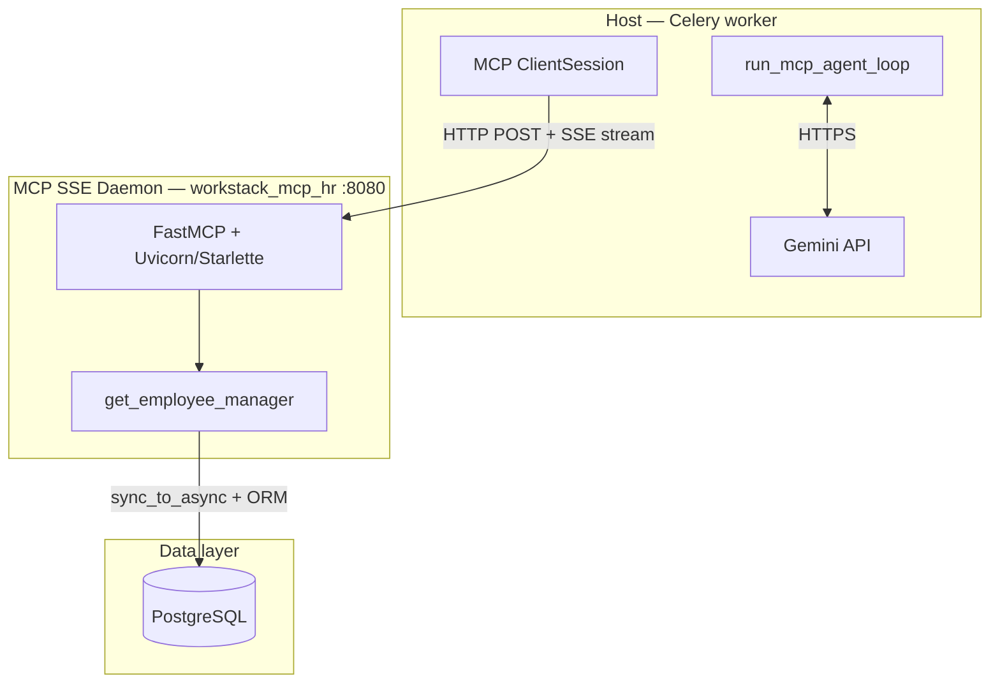

# MCP over SSE/HTTP — Complete Guide

This document covers the **persistent SSE (Server-Sent Events) MCP daemon** in Workstack: architecture, Docker setup, the Django async/ORM boundary, isolated testing (without Gemini), and the full Celery → Gemini → SSE production loop.

For stdio subprocess MCP and `ToolConfig`, see [MCP_INTEGRATION.md](MCP_INTEGRATION.md). For protocol concepts, see [MCP_DEEP_DIVE.md](MCP_DEEP_DIVE.md).

---

## Table of Contents

1. [Why SSE Instead of stdio](#1-why-sse-instead-of-stdio)
2. [Architecture Overview](#2-architecture-overview)
3. [The HR MCP Daemon (`hr_server.py`)](#3-the-hr-mcp-daemon-hr_serverpy)
4. [FastMCP API Change: host/port in Constructor](#4-fastmcp-api-change-hostport-in-constructor)
5. [Docker Setup](#5-docker-setup)
6. [The Async Boundary: Why `sync_to_async`](#6-the-async-boundary-why-sync_to_async)
7. [stdio vs SSE: Execution Context](#7-stdio-vs-sse-execution-context)
8. [Test Without Gemini (Isolated Client Test)](#8-test-without-gemini-isolated-client-test)
9. [Full Production Loop: Celery → Gemini → SSE](#9-full-production-loop-celery--gemini--sse)
10. [Troubleshooting](#10-troubleshooting)

---

## 1. Why SSE Instead of stdio

| Concern | stdio subprocess | SSE daemon |
|---------|------------------|------------|
| Django boot | Every Celery task (~1–2s) | Once at container start |
| DB connection pool | New pool per spawn | Warm, persistent pool |
| Transport | OS pipes (stdin/stdout) | HTTP + SSE on port 8080 |
| Process model | Spawn → query → die | Runs 24/7 like Gunicorn |
| Best for | Dev, proving the loop | Production, shared tool fleet |

When Celery uses stdio, each task forks `mcp_org_server.py`, calls `django.setup()`, queries Postgres, and exits. With SSE, `workstack_mcp_hr` boots once and serves tool calls over HTTP — Celery only opens a socket.

For production gaps (stdio trust, log chunking, SSE scale) and Workstack's fix roadmap, see [MCP_PROTOCOL_GAPS_AND_CONTRIBUTIONS.md](MCP_PROTOCOL_GAPS_AND_CONTRIBUTIONS.md).

---

## 2. Architecture Overview



### Layer responsibilities

| Layer | Component | File | Role |
|-------|-----------|------|------|
| **Host** | Celery task | `apps/organizations/tasks.py` | Holds `GEMINI_API_KEY`, orchestrates Turn 1 + Turn 2 |
| **Client** | `sse_client` + `ClientSession` | MCP Python SDK | JSON-RPC over HTTP/SSE |
| **Server** | FastMCP daemon | `mcp_daemons/hr_server.py` | Persistent ASGI web server, Django ORM tools |
| **Database** | PostgreSQL | Docker `db` service | Employee org chart data |

**Important:** Gemini never talks to the MCP Server directly. Only the Host talks to both.

---

## 3. The HR MCP Daemon (`hr_server.py`)

**Path:** `backend/mcp_daemons/hr_server.py`

```python
import os
import sys
import django
from asgiref.sync import sync_to_async
from mcp.server.fastmcp import FastMCP

PROJECT_ROOT = os.path.abspath(os.path.join(os.path.dirname(__file__), ".."))
sys.path.append(PROJECT_ROOT)
os.environ.setdefault("DJANGO_SETTINGS_MODULE", "core.settings.local")
django.setup()  # Runs ONCE at process start

from django.contrib.auth import get_user_model
from apps.hris.models import Employee

# host/port moved to constructor (FastMCP API change)
mcp = FastMCP("Workstack_HR_Daemon", host="0.0.0.0", port=8080)

@mcp.tool()
async def get_employee_manager(email: str) -> str:
    """Fetch the manager for an employee. Pass the employee's email address."""

    @sync_to_async
    def _query_db():
        User = get_user_model()
        user = User.objects.get(username=email)
        employee = Employee.objects.get(user=user)
        manager = employee.get_parent()  # Treebeard parent, not FK
        if manager:
            return f"Manager: {manager.user.first_name} {manager.user.last_name} ({manager.user.username})"
        return "This employee has no assigned manager."

    return await _query_db()

if __name__ == "__main__":
    print("Starting MCP SSE Daemon on port 8080...")
    mcp.run(transport="sse")  # No host/port here — see Section 4
```

### Lookup chain

1. `User.objects.get(username=email)` — email is stored as username
2. `Employee.objects.get(user=user)` — org chart node
3. `employee.get_parent()` — Treebeard manager (materialized path parent)

There is no `Employee.email` field; email lives on `User.username`.

---

## 4. FastMCP API Change: host/port in Constructor

**Error you may see:**

```
TypeError: FastMCP.run() got an unexpected keyword argument 'host'
```

Recent `mcp` package versions moved network binding from `.run()` to the constructor.

| Old (broken) | New (correct) |
|--------------|---------------|
| `mcp = FastMCP("Name")` | `mcp = FastMCP("Name", host="0.0.0.0", port=8080)` |
| `mcp.run(transport="sse", host="0.0.0.0", port=8080)` | `mcp.run(transport="sse")` |

After fixing, restart the container:

```bash
docker restart workstack_mcp_hr
# or
docker compose restart mcp_hr_daemon
```

---

## 5. Docker Setup

From `docker-compose.yml`:

```yaml
mcp_hr_daemon:
  build:
    context: ./backend
  container_name: workstack_mcp_hr
  command: python mcp_daemons/hr_server.py
  volumes:
    - ./backend:/app
  ports:
    - "8080:8080"
  env_file:
    - .env
  depends_on:
    - db
```

### Boot sequence

1. Entrypoint waits for PostgreSQL
2. Migrations run (via shared `entrypoint.sh` when command starts with `python`)
3. `django.setup()` in `hr_server.py`
4. FastMCP starts SSE server on `0.0.0.0:8080`

### Verify daemon is alive

```bash
docker logs workstack_mcp_hr
# Expected tail:
# Starting MCP SSE Daemon on port 8080...
```

SSE endpoint (MCP client): `http://localhost:8080/sse`  
Inside Docker network: `http://workstack_mcp_hr:8080/sse`

---

## 6. The Async Boundary: Why `sync_to_async`

### This is NOT caused by `django.setup()`

`django.setup()` only loads the app registry. The async error comes from **`mcp.run(transport="sse")`**, which boots an **ASGI web server** (Starlette/Uvicorn under FastMCP) with an **asyncio event loop** to hold many HTTP connections open.

### The error

```
Error executing tool get_employee_manager:
You cannot call this from an async context - use a thread or sync_to_async.
```

### Why it happens

| Runtime | Event loop? | ORM safe? |
|---------|-------------|-----------|
| stdio subprocess (`mcp_org_server.py`) | No — plain sync script | Yes, direct ORM |
| SSE daemon (`hr_server.py`) | Yes — ASGI server | No, unless wrapped |

When `@mcp.tool()` is `async def`, tool code runs **inside the event loop**. Django's ORM uses blocking C-level `recv()` on PostgreSQL sockets. Running that on the event loop would freeze all SSE clients.

Django's safety check detects the active loop and raises before blocking.

### The fix: `sync_to_async`

```python
@sync_to_async
def _query_db():
    user = User.objects.get(username=email)  # blocking ORM
    ...

return await _query_db()
```

This offloads the synchronous ORM block to a **background thread pool** so the event loop stays free for other HTTP connections.

### Why User failed but Employee "seemed" to work

Both queries are synchronous. The error triggers on the **first** ORM call inside an async context. If an earlier code path failed differently, you might see inconsistent messages — both `User.objects.get` and `Employee.objects.get` require `sync_to_async` when the tool is `async def`.

### Is the MCP server like Gunicorn?

Yes, architecturally. `hr_server.py` is a **standalone ASGI web process**:

- Gunicorn + WSGI → serves Django REST API
- FastMCP + SSE → serves MCP tool calls

Both hold long-lived connections and talk to PostgreSQL.

---

## 7. stdio vs SSE: Execution Context

### stdio (Celery spawns subprocess)

```
Celery worker (sync process)
  └─ spawns mcp_org_server.py (sync subprocess)
       └─ django.setup() → ORM query → exit
```

Celery acts as Host **and** spawns the Server. Communication is OS pipes.

### SSE (daemon always running; shell test bypasses Celery)

```
Terminal / Django shell (temporary Client)
  └─ HTTP → workstack_mcp_hr:8080/sse
       └─ daemon (async ASGI) → sync_to_async → ORM → response
```

No Celery required for the isolated test. You prove Client ↔ Server ↔ Postgres before spending Gemini quota.

### Celery is NOT calling Gemini from the daemon

Production flow:

1. **Celery worker** (Host) calls Gemini over HTTPS (2–10s wait)
2. **Same worker** (Client) calls MCP daemon over HTTP (milliseconds)
3. **Daemon** (Server) queries Postgres

The daemon never calls Gemini. Async on the daemon exists for **concurrent HTTP tool requests**, not for Gemini latency.

---

## 8. Test Without Gemini (Isolated Client Test)

Architects test MCP Client ↔ Server in isolation before involving the LLM.

### Option A: Django test suite

```bash
# Terminal 1 — ensure daemon is running
docker compose up mcp_hr_daemon

# Terminal 2 — run integration test from web container
docker compose exec web python manage.py test apps.organizations.tests.test_mcp_sse -v 2
```

See `backend/apps/organizations/tests/test_mcp_sse.py`.

Environment variables:

| Variable | Default | Purpose |
|----------|---------|---------|
| `MCP_SSE_URL` | `http://workstack_mcp_hr:8080/sse` | Daemon SSE endpoint |
| `MCP_SSE_TEST_EMAIL` | `shuaib@workstack.dev` | User username/email in DB |

### Option B: Django shell script

```python
import asyncio
from mcp import ClientSession
from mcp.client.sse import sse_client

async def test_sse_connection():
    url = "http://workstack_mcp_hr:8080/sse"  # Docker network hostname

    print("1. Opening HTTP connection to Daemon...")
    async with sse_client(url) as (read, write):
        async with ClientSession(read, write) as session:
            print("2. Handshaking...")
            await session.initialize()

            print("3. Forcing Tool Execution (No AI needed!)...")
            result = await session.call_tool(
                "get_employee_manager",
                {"email": "shuaib@acmecorp.com"},  # real username in your DB
            )

            print("\nSUCCESS! The persistent daemon returned:")
            print(result.content[0].text)

asyncio.run(test_sse_connection())
```

**Success output:**

```
SUCCESS! The persistent daemon returned:
Manager: Shuaib Sayyad (shuaib@acmecorp.com)
```

This confirms:

1. Daemon runs persistently
2. Warm PostgreSQL connection pool works
3. Client pulls data over HTTP without subprocess spawn

---

## 9. Full Production Loop: Celery → Gemini → SSE

**Task:** `run_ai_org_lookup_sse` in `apps/organizations/tasks.py`

```python
url = "http://workstack_mcp_hr:8080/sse"  # use container name in Docker

async with sse_client(url) as (read, write):
    async with ClientSession(read, write) as mcp_session:
        await mcp_session.initialize()
        # Turn 1: Gemini + ToolConfig ANY (recommended — see MCP_INTEGRATION.md)
        # Turn 2: call_tool over HTTP (fast)
        # Turn 3: Gemini summary with AUTO mode
```

### Differences from stdio path

| Step | stdio | SSE |
|------|-------|-----|
| Server boot | Per task subprocess | Already running |
| Client transport | `stdio_client` | `sse_client` |
| URL | Path to `.py` script | `http://workstack_mcp_hr:8080/sse` |
| Django boot cost | Every task | Zero per task |

**Reminder:** Add `FunctionCallingConfigMode.ANY` on Turn 1 in the SSE task (same as stdio) to prevent Gemini from refusing email-based lookup.

---

## 10. Troubleshooting

| Symptom | Cause | Fix |
|---------|-------|-----|
| `FastMCP.run() got unexpected keyword argument 'host'` | Old API usage | Move `host`/`port` to `FastMCP(...)` constructor |
| `You cannot call this from an async context` | ORM in `async def` tool | Wrap ORM in `@sync_to_async` |
| `No user found with username/email` | Wrong test email | Use `User.username` value from DB |
| Connection refused on 8080 | Daemon not running | `docker compose up mcp_hr_daemon` |
| Empty tool list / handshake fail | Wrong URL | Must be `/sse` path, not root |
| Gemini works but SSE fails | Separate issues | Run Section 8 test first |

### Debug stderr on daemon (safe for SSE)

```python
import sys
print(f"[MCP SERVER] lookup {email}", file=sys.stderr)
```

Never log to stdout on stdio servers; stderr is fine for both transports.

---

## Quick Reference

| Item | Value |
|------|-------|
| Daemon file | `backend/mcp_daemons/hr_server.py` |
| Container | `workstack_mcp_hr` |
| Port | `8080` |
| SSE URL (Docker) | `http://workstack_mcp_hr:8080/sse` |
| SSE URL (host) | `http://localhost:8080/sse` |
| Celery SSE task | `run_ai_org_lookup_sse` |
| Isolated test | `apps.organizations.tests.test_mcp_sse` |

---

[← MCP Integration (stdio)](MCP_INTEGRATION.md) · [← MCP Deep Dive](MCP_DEEP_DIVE.md) · [← README](../README.md)
