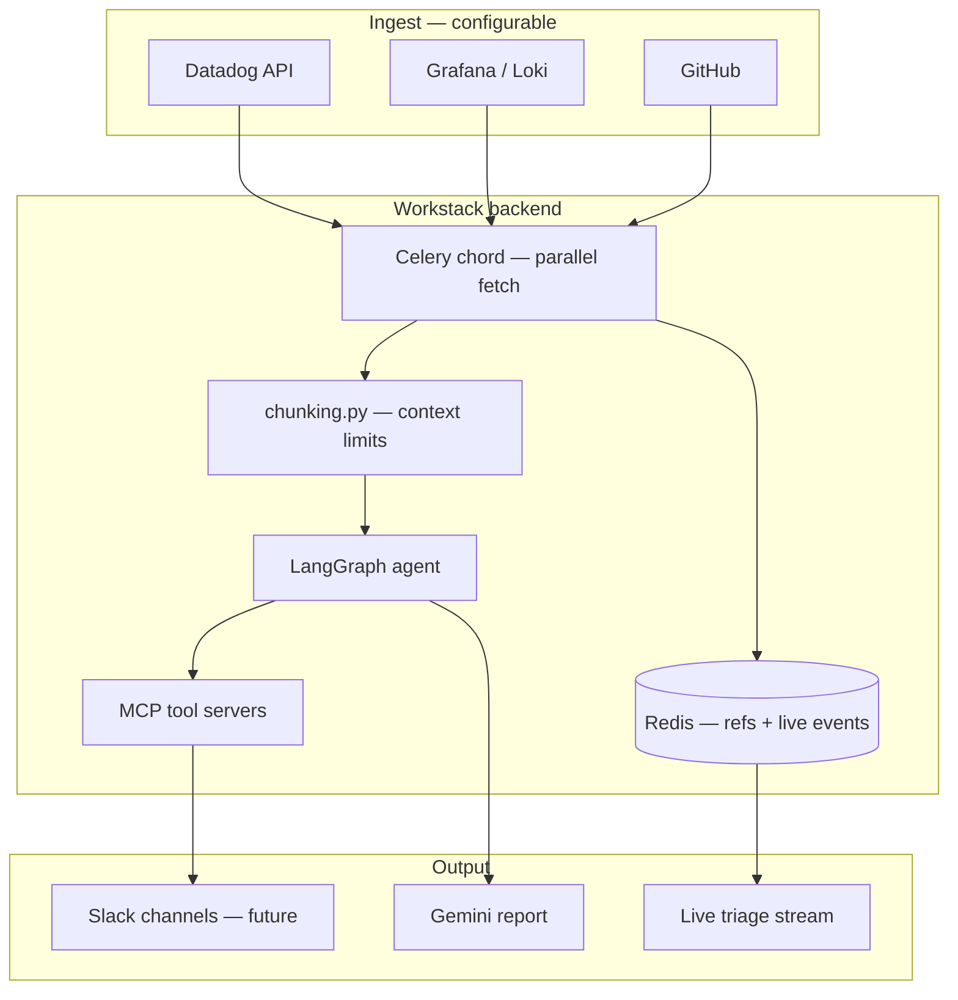
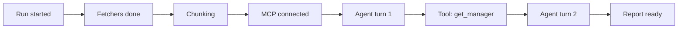

# Triage Product — Roadmap & Live Diagnosis UI

How Workstack evolves from the Phase 5 agent demo into a **configurable triage product**: telemetry in, chunked context for Gemini, MCP tools out, live checkpoints for engineers.

**Code today:** `apps/incidents/` · **Run guide:** [INCIDENT_TRIAGE_AGENT.md](INCIDENT_TRIAGE_AGENT.md) · **Q&A / design notes:** [INCIDENT_TRIAGE_QA.md](INCIDENT_TRIAGE_QA.md) · **MCP gaps:** [MCP_PROTOCOL_GAPS_AND_CONTRIBUTIONS.md](MCP_PROTOCOL_GAPS_AND_CONTRIBUTIONS.md)

---

## Table of Contents

1. [Product shape](#1-product-shape)
2. [What shipped in chunk 1](#2-what-shipped-in-chunk-1)
3. [Gap C — log chunking (current focus)](#3-gap-c--log-chunking-current-focus)
4. [Live triage display — real use case?](#4-live-triage-display--real-use-case)
5. [Configurable integrations (next)](#5-configurable-integrations-next)
6. [Slack MCP server (later)](#6-slack-mcp-server-later)
7. [Phased roadmap](#7-phased-roadmap)

---

## 1. Product shape



| Layer | Role |
|-------|------|
| **Fetchers** | Pull telemetry/logs/commits in parallel (Celery) — replace mocks with real API clients from config |
| **Chunking** | Cap inline LLM context; store full payloads in Redis with reference ids |
| **LangGraph** | Reason over chunked context; call MCP tools mid-loop |
| **MCP servers** | HR today; Slack/GitHub/Postgres tools tomorrow — one daemon per domain |
| **Live UI** | SSE stream of checkpoints so engineers see *what* is being diagnosed, not a black box |

---

## 2. What shipped in chunk 1

| Piece | File | Purpose |
|-------|------|---------|
| SSE MCP client (default) | `mcp_client.py` | Talk to `workstack_mcp_hr:8080` — no stdio spawn per task |
| Log chunking | `chunking.py` | `TRIAGE_REF` markers + Redis-backed full text |
| Live checkpoints | `events.py` | Redis list + pub/sub per `run_id` |
| SSE API | `views.py` | `GET /api/v1/incidents/runs/<run_id>/stream/` |
| Agent wiring | `tasks.py` | Chunked prompt + checkpoint emissions |

### Trigger and watch live

```python
from apps.incidents.tasks import trigger_incident_workflow
trigger_incident_workflow()
# Prints run_id and stream URL
```

```bash
# Browser or curl — live checkpoints
curl -N http://localhost:8000/api/v1/incidents/runs/<run_id>/stream/

# Poll JSON history
curl http://localhost:8000/api/v1/incidents/runs/<run_id>/events/
```

Example events:

```json
{"stage": "triage.start", "message": "Starting triage for srv-production-01", ...}
{"stage": "chunk.complete", "message": "Telemetry payloads prepared for LLM context limits"}
{"stage": "mcp.connect", "message": "Connecting to HR MCP server"}
{"stage": "agent.invoke", "message": "LangGraph ReAct agent running"}
{"stage": "triage.complete", "message": "Incident report ready", "report_preview": "..."}
```

### Environment

```env
MCP_TRANSPORT=sse
MCP_SSE_URL=http://workstack_mcp_hr:8080/sse
TRIAGE_MAX_INLINE_CHARS=8000
TRIAGE_CHUNK_SIZE=4000
```

Set `MCP_TRANSPORT=stdio` only when the SSE daemon is not running (local dev).

---

## 3. Gap C — log chunking (current focus)

### The problem

Datadog, Grafana Loki, and `pg_stat_activity` dumps can be **megabytes**. MCP and LLMs expect **inline tool text** — sending everything breaks context, cost, and reasoning.

### Workstack approach (chunk 1)

1. Each fetcher result is JSON-serialized.
2. If under `TRIAGE_MAX_INLINE_CHARS` → full inline in prompt.
3. If over → first N chars inline + `[TRIAGE_REF source=... id=... chunks=...]` + full body in Redis (`triage:ref:<id>`).

### Chunk 2 (next code)

| Item | Description |
|------|-------------|
| MCP tool `read_triage_chunk(ref_id, index)` | Agent pulls extra slices on demand during ReAct |
| Apply to MCP tool **responses** | Middleware on heavy tool output, not just Celery fetchers |
| Vector summary | Optional embed + summary line for huge logs before chunk store |

This is the **primary protocol gap** Workstack fills for triage — not client connection pooling on SSE.

---

## 4. Live triage display — real use case?

**Yes — for on-call and war rooms**, not vanity UI.

When triage takes 20–60 seconds (parallel fetch + multiple Gemini turns + MCP tools), engineers ask:

- Is it stuck or working?
- Which data source is slow?
- Did MCP / HR lookup fail?
- Can I preview the report before Slack fires?

A **live checkpoint stream** answers that without reading Celery logs.

### Recommended UI path (not browser extension first)

| Phase | UI | Why |
|-------|-----|-----|
| **Now** | SSE endpoint + curl / simple HTML page | Zero new infra; proves protocol |
| **Next** | React panel in existing Workstack frontend | Same auth, org context, run history |
| **Later** | Desktop menu bar / PagerDuty sidebar | Only after core product works |

**Avoid for v1:** browser extension — extra store review, permissions, and duplicate auth. A **web dashboard tab** next to your HRIS app is faster to ship and easier in interviews ("SSE from Redis pub/sub, same pattern as MCP SSE").

### What to show on screen



Each step maps 1:1 to `publish_checkpoint()` stages in `tasks.py`. Future: sub-checkpoints per tool call via LangGraph callbacks.

---

## 5. Configurable integrations (next)

Replace mock fetchers with a **triage profile** (YAML or DB model):

```yaml
# config/triage.example.yaml — illustrative
server_id: srv-production-01
integrations:
  datadog:
    enabled: true
    api_key_env: DATADOG_API_KEY
    queries:
      - metric: system.cpu.user
        host: "{{ server_id }}"
  grafana:
    enabled: false
    loki_url: https://loki.example.com
    logql: '{app="api"} |= "502"'
  github:
    enabled: true
    repo: org/service
    lookback_minutes: 30
```

Celery fetchers become thin wrappers: read config → call API → return dict → **chunking** → chord callback.

You are **not overstating** — this is how commercial AIOps copilots are structured. Workstack starts with one mock per source and swaps in real clients.

---

## 6. Slack MCP server (later)

**Real use case:** after the agent produces a report, post to `#incidents` or DM the on-call manager — but only via an explicit tool or approval node (LangGraph HITL).

Planned shape:

```yaml
notifications:
  slack:
    enabled: true
    channels:
      - "#incidents"
      - "#platform-oncall"
    post_on: triage.complete
```

Implemented as `mcp_daemons/slack_server.py` with tools `post_incident_update(channel, text)` — not hardcoded in the agent prompt.

---

## 7. Phased roadmap

| Phase | Deliverable | Status |
|-------|-------------|--------|
| **1** | SSE MCP in LangGraph path | Done |
| **1** | Chunking + Redis references | Done |
| **1** | Live checkpoint SSE API | Done |
| **2** | `read_triage_chunk` MCP tool | Done |
| **2** | Triage config YAML + real Datadog fetcher | Planned |
| **3** | React live triage panel | Planned |
| **4** | Slack MCP + notification config | Planned |
| **5** | Multi-server MCP (GitHub, Postgres stats) | Planned |
| **6** | Alert webhooks (Grafana / Sentry → auto triage) | Planned |
| **7** | Vector log ingest + semantic retrieval (Pattern C) | Research — [INCIDENT_TRIAGE_RESEARCH.md](INCIDENT_TRIAGE_RESEARCH.md) |
| **8** | Extract `mcp_chunking` library from `chunking.py` | Planned after API stable |
| **9** | Next.js live panel + WebSockets (HITL) | Planned |

Full strategy discussion: [INCIDENT_TRIAGE_RESEARCH.md](INCIDENT_TRIAGE_RESEARCH.md).
