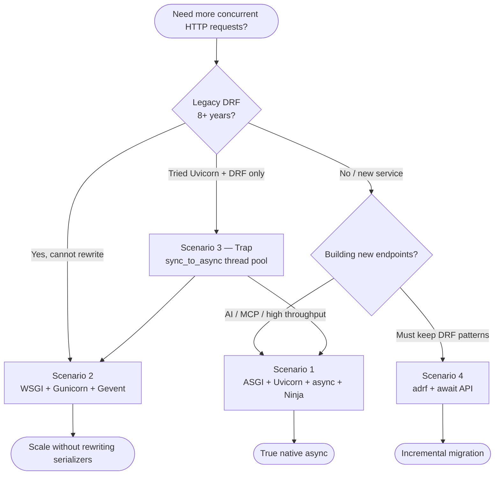
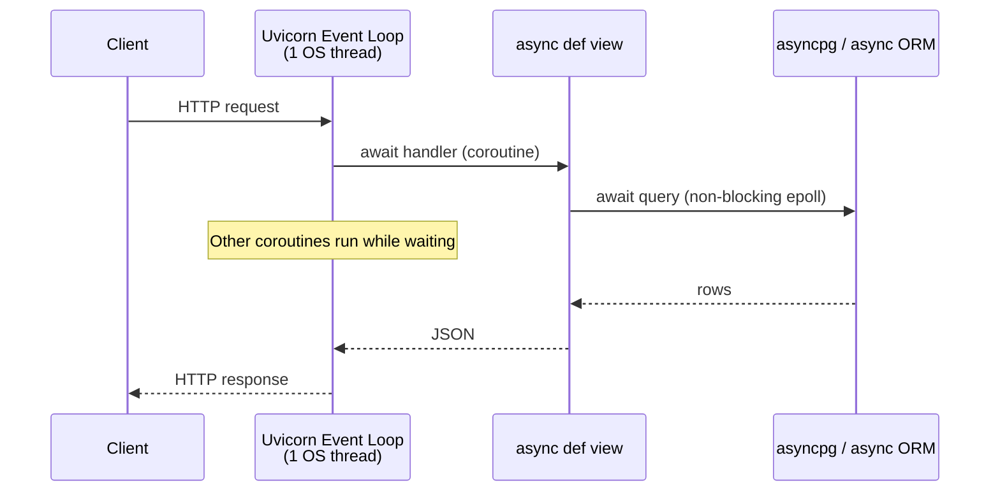
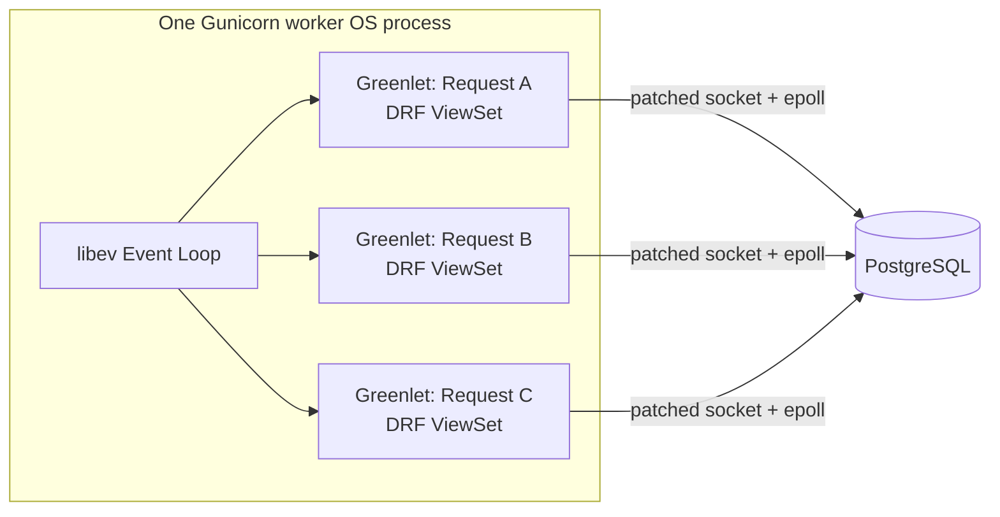
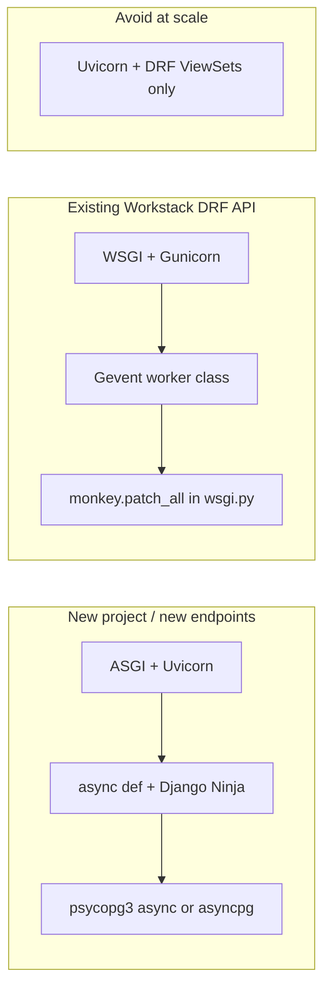

# WSGI + Gevent vs ASGI + Uvicorn — Scaling Django & DRF

A practical guide for architects choosing how to run Workstack (or any legacy DRF monolith) under load — without rewriting eight years of serializers overnight.

Related: [CELERY_GEVENT.md](CELERY_GEVENT.md) (async **workers**, not web server).

---

## Table of Contents

1. [Four Scenarios at a Glance](#1-four-scenarios-at-a-glance)
2. [Decision Flowchart](#2-decision-flowchart)
3. [Scenario 1: ASGI + Uvicorn + async views (+ Django Ninja)](#3-scenario-1-asgi--uvicorn--async-views--django-ninja)
4. [Scenario 2: WSGI + Gunicorn + Gevent (Legacy DRF Savior)](#4-scenario-2-wsgi--gunicorn--gevent-legacy-drf-savior)
5. [Scenario 3: ASGI + Uvicorn + DRF (Fake Async)](#5-scenario-3-asgi--uvicorn--drf-fake-async)
6. [Scenario 4: Why True Async DRF Is So Hard](#6-scenario-4-why-true-async-drf-is-so-hard)
7. [Event Loop vs Thread Pool vs Greenlets](#7-event-loop-vs-thread-pool-vs-greenlets)
8. [psycopg2 vs psycopg3 and Blocking recv()](#8-psycopg2-vs-psycopg3-and-blocking-recv)
9. [Exact Docker Commands for Workstack](#9-exact-docker-commands-for-workstack)
10. [When to Use What (New vs Legacy)](#10-when-to-use-what-new-vs-legacy)

---

## 1. Four Scenarios at a Glance

| # | Stack | Real concurrency? | Rewrite DRF? | Best for |
|---|-------|-------------------|--------------|----------|
| **1** | Uvicorn + `async def` + Ninja/Pydantic | ✅ Yes — single thread, epoll | New endpoints only | Greenfield APIs, AI/MCP routes |
| **2** | WSGI + Gevent + monkey patch | ✅ Yes — greenlets + epoll under the hood | ❌ No | Legacy DRF monoliths |
| **3** | Uvicorn + DRF (`def` views) | ❌ No — thread pool (~40 threads) | ❌ No | **Avoid for scale** |
| **4** | Uvicorn + adrf (`await serializer.ais_valid()`) | ✅ Yes, per migrated view | ⚠️ Partial rewrite | Gradual ASGI migration |

---

## 2. Decision Flowchart



---

## 3. Scenario 1: ASGI + Uvicorn + async views (+ Django Ninja)

### Architecture



**Zero thread pool** when everything is truly async (async view + async DB driver).

### Why Django Ninja if plain `async def` works?

Plain `async def my_view(request)` is fully async. Ninja adds what DRF gave you:

- Pydantic validation (`email: str`, not manual `json.loads`)
- Automatic OpenAPI / Swagger
- Typed request/response models

DRF exists for developer experience; Ninja is the async-era equivalent.

### Workstack use case

New MCP-adjacent HTTP endpoints, webhooks, or AI proxy routes — **not** rewriting existing ViewSets.

---

## 4. Scenario 2: WSGI + Gunicorn + Gevent (Legacy DRF Savior)

### Architecture



### Boot sequence

```bash
gunicorn core.wsgi:application \
  --bind 0.0.0.0:8000 \
  --workers 3 \
  --worker-class gevent \
  --worker-connections 1000
```

1. Gunicorn master binds port 8000
2. Forks 3 **OS processes**
3. Each process starts a **Gevent libev event loop** (because of `--worker-class gevent`)
4. Each process handles up to **1000 greenlets** (`--worker-connections`)

### Greenlets vs POSIX threads

| | Greenlet | POSIX thread (`pthread`) |
|---|----------|--------------------------|
| OS aware? | ❌ No — pure Python stack switch | ✅ Yes — kernel scheduled |
| RAM | Kilobytes | ~1–8 MB each |
| GIL | One greenlet runs Python at a time | Same GIL limitation |
| Purpose | Write sync code; Gevent parks on I/O | True parallel OS scheduling |

**Gevent uses epoll** — greenlets are how your synchronous DRF code is organized; epoll is how the kernel notifies when Postgres data arrives.

### wsgi.py changes

```python
# core/wsgi.py — apply BEFORE Django imports

from gevent import monkey
monkey.patch_all()  # Patches socket, ssl, select, etc.

# Only if using psycopg2 (NOT needed for psycopg v3):
# import psycogreen.gevent
# psycogreen.gevent.patch_psycopg()

import os
from django.core.wsgi import get_wsgi_application

os.environ.setdefault('DJANGO_SETTINGS_MODULE', 'core.settings.local')
application = get_wsgi_application()
```

Workstack uses **psycopg v3** (`psycopg[binary]`) — gevent's `monkey.patch_all()` is sufficient; skip psycogreen.

### Is WSGI + Gevent ≈ ASGI + Uvicorn?

For **I/O-bound concurrent HTTP**, yes — similar throughput goals:

| | WSGI + Gevent | ASGI + Uvicorn |
|---|---------------|----------------|
| Event loop | libev (hidden) | uvloop/asyncio (explicit) |
| Code style | Sync `def` views | `async def` + `await` |
| DRF | Works unchanged | Falls to thread pool |
| Mental model | "Fake sync, real epoll" | "Explicit coroutines" |

---

## 5. Scenario 3: ASGI + Uvicorn + DRF (Fake Async)

### What happens

```mermaid
flowchart TD
    Req[HTTP Request] --> UV[Uvicorn Event Loop]
    UV --> DRF[DRF def post(...)]
    DRF --> Wrap{Django detects sync view}
    Wrap --> TP[ThreadPoolExecutor<br/>~40 threads default]
    TP --> ORM[Blocking ORM + psycopg recv]
    ORM --> TP
    TP --> UV
    UV --> Resp[Response]

    Req2[Request 41+] --> Wait[Queued waiting for free thread]
```

You run:

```bash
gunicorn core.asgi:application \
  --bind 0.0.0.0:8000 \
  --workers 3 \
  -k uvicorn.workers.UvicornWorker
```

Uvicorn starts a beautiful event loop — then **every DRF view** is wrapped in `sync_to_async` and thrown into a **~40-thread pool**.

| Users | What happens |
|-------|--------------|
| 1–40 | Threads block on DB; loop mostly idle |
| 41+ | Connections accepted but **wait for threads** |
| Result | **Zero async benefit**; often **worse** than plain WSGI due to overhead |

This is the Avoma trap: Uvicorn + legacy DRF without gevent or native async views.

### What is Uvicorn vs Gunicorn?

| Component | Role |
|-----------|------|
| **Gunicorn** | Process manager — forks workers, restarts crashes |
| **Uvicorn** | ASGI **engine** — HTTP parsing + event loop |
| **`-k uvicorn.workers.UvicornWorker`** | "Gunicorn, use Uvicorn as the worker class" |

Default Gunicorn workers are synchronous WSGI. The `-k` flag swaps in Uvicorn's ASGI loop.

---

## 6. Scenario 4: Why True Async DRF Is So Hard

Community package **adrf** exists because core DRF cannot flip async without breaking API contracts.

### Blockers in DRF's design (2011-era sync)

| Pattern | Problem |
|---------|---------|
| `serializer.data` | Python `@property` — **cannot** `await serializer.data` |
| `serializer.is_valid()` | Runs sync validators that hit DB (`UniqueValidator`) |
| JSON renderer | Sync `for item in queryset` hits DB lazily |

### adrf alternative API

```python
if await serializer.ais_valid():
    await serializer.asave()
    return Response(await serializer.adata)
```

Still a **rewrite** — but keeps DRF-like patterns on Uvicorn's real event loop.

### Why no magic C-wrapper for all DRF?

That **is** Gevent on WSGI — intercept blocking C sockets under synchronous code.

True native async requires **non-blocking DB drivers** (`asyncpg`, psycopg3 async mode) end-to-end — DRF's internals don't use them.

---

## 7. Event Loop vs Thread Pool vs Greenlets

### Thread pool (`sync_to_async` under Uvicorn + DRF)

- Real **pthread** threads (POSIX)
- OS context switch cost + ~MB RAM per thread
- Useful to **protect** the event loop from blocking sync code
- Bottleneck: ~40 concurrent DRF requests default

### Event loop (pure async)

- **One OS thread**, many coroutines
- Waits via **epoll** — no OS thread per request
- Coroutine = kilobytes of RAM
- Requires `async def` + async-safe libraries throughout

### Greenlets (Gevent on WSGI)

- **Not** POSIX threads — saved Python stack frames
- Gevent uses **epoll** underneath patched sockets
- Lets you write sync DRF; yields on I/O automatically

### Pure `async def` — does it use blocking recv()?

No. Async psycopg3 / asyncpg:

1. Socket set `O_NONBLOCK`
2. `recv()` returns `EWOULDBLOCK`
3. FD registered with **epoll**
4. Coroutine suspended; loop serves others
5. Kernel wakes epoll when data arrives

---

## 8. psycopg2 vs psycopg3 and Blocking recv()

| Driver | Default mode | Under DRF sync view |
|--------|--------------|---------------------|
| **psycopg2** | Blocking C `recv()` | Blocks thread or greenlet until patched |
| **psycopg3** (`psycopg[binary]`) | Sync + **native async** API | Sync path still blocks unless gevent-patched or async API used |

Workstack `requirements/base.txt`:

```
psycopg[binary]>=3
```

- **Gevent + WSGI:** `monkey.patch_all()` — psycopg3 cooperates
- **Uvicorn + async views:** use psycopg3 **async connection** — no recv() block on event loop
- **psycogreen:** only for psycopg2

---

## 9. Exact Docker Commands for Workstack

Current `docker-compose.yml` `web` service:

```yaml
web:
  # ── Current (development default) ──
  command: gunicorn core.wsgi:application --bind 0.0.0.0:8000 --workers 3 --reload

  # ── Scenario 2: Legacy DRF + high concurrency (future) ──
  # Requires: pip install gevent + monkey.patch_all() in core/wsgi.py
  # command: gunicorn core.wsgi:application --bind 0.0.0.0:8000 --workers 3 --worker-class gevent --worker-connections 1000 --reload

  # ── Scenario 3/1: ASGI + Uvicorn (future — new async endpoints) ──
  # Requires: pip install uvicorn
  # command: gunicorn core.asgi:application --bind 0.0.0.0:8000 --workers 3 -k uvicorn.workers.UvicornWorker --reload
```

Fix `core/asgi.py` settings module before using ASGI:

```python
os.environ.setdefault('DJANGO_SETTINGS_MODULE', 'core.settings.local')
```

Celery gevent (separate doc):

```yaml
# command: celery -A core worker -l info --pool=gevent --concurrency=500
```

---

## 10. When to Use What (New vs Legacy)



| Your situation | Choose |
|----------------|--------|
| Ship Workstack HRIS API as-is, handle peak traffic | **WSGI + Gevent** — minimal code change |
| New AI/MCP HTTP micro-endpoints | **ASGI + Uvicorn + Ninja** — true async |
| Already on Uvicorn + DRF, slow under load | Move to **Gevent WSGI** OR migrate hot paths to **Ninja/adrf** |
| MCP SSE daemon (`hr_server.py`) | **Separate ASGI process** — already correct architecture |
| Celery + many Gemini calls | **prefork** (simple) or **gevent pool** (scale) — see Celery doc |

### Workstack-specific mapping

| Component | Recommended server |
|-----------|-------------------|
| `web` (DRF REST API) | WSGI + Gevent for production scale; current sync Gunicorn for dev |
| `mcp_hr_daemon` | FastMCP SSE (ASGI) — standalone, not Gunicorn |
| `celery` | prefork now; gevent when LLM task volume grows |

---

## Summary Table

| Question | Answer |
|----------|--------|
| Are Python thread pool threads real OS threads? | **Yes** — `pthread_create()` on Linux |
| Uvicorn + DRF real async? | **No** — thread pool fallback |
| WSGI + Gevent ≈ Uvicorn for concurrency? | **For I/O-bound HTTP, yes** (different code style) |
| Is Uvicorn just a Gunicorn worker class? | Uvicorn is the **ASGI server**; Gunicorn **manages** Uvicorn worker processes |
| psycopg3 blocking on async loop? | Sync API blocks; use **async API** or **gevent patch** |
| Fourth scenario for DRF? | **adrf** — partial rewrite with `await ais_valid()` / `adata` |

---

[← Celery Gevent](CELERY_GEVENT.md) · [← MCP SSE](MCP_SSE_HTTP.md) · [← README](../README.md)
